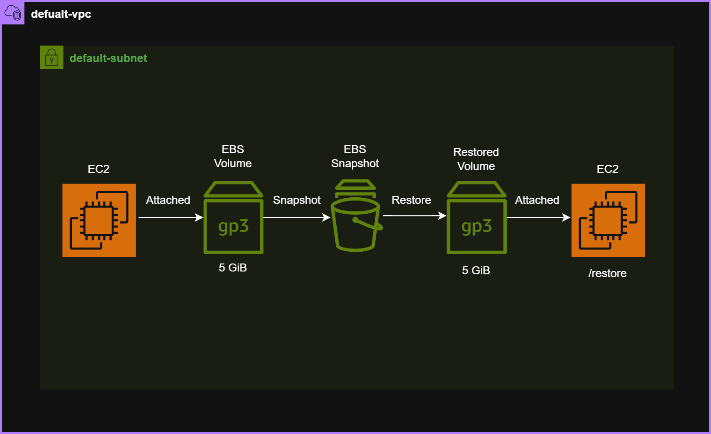

# Lab 05: EC2 EBS Volumes and Snapshots

## Objective

Learn how to create, attach, mount, back up, and restore EBS volumes on an EC2 instance.

This lab also introduces fundamental Linux disk management concepts that every Cloud Engineer should know.

---

# Architecture


---

# AWS Services Used

* Amazon EC2
* Amazon EBS
* EBS Snapshots

---

# Linux Concepts Covered

* Block Devices
* Filesystems
* Mount Points
* UUIDs
* Persistent Mounts
* Backup & Recovery

---

# Task 1: Launch EC2 Instance

## Configuration

| Setting        | Value             |
| -------------- | ----------------- |
| Name           | ebs-lab-server    |
| AMI            | Amazon Linux 2023 |
| Instance Type  | t3.micro          |
| VPC            | Default VPC       |
| Security Group | ebs-lab-sg        |

### Security Group

| Type | Source |
| ---- | ------ |
| SSH  | My IP  |

---

# Task 2: Create EBS Volume

## Configuration

| Setting           | Value          |
| ----------------- | -------------- |
| Name              | data-volume    |
| Type              | gp3            |
| Size              | 5 GiB          |
| Availability Zone | Same AZ as EC2 |

## Important

EBS volumes can only be attached to EC2 instances in the same Availability Zone.

Example:

```text
EC2 → us-east-1a
EBS → us-east-1a
```

---

# Task 3: Attach EBS Volume

## Configuration

| Setting     | Value          |
| ----------- | -------------- |
| Instance    | ebs-lab-server |
| Device Name | /dev/sdf       |

### Verify

```bash
lsblk
```

Output:

```text
nvme1n1       259:4    0   5G  0 disk
```

## Learning

At this stage Linux can see the disk, but it cannot store files because no filesystem exists yet.

---

# Task 4: Format and Mount Volume

## Create Filesystem

```bash
sudo mkfs -t xfs /dev/nvme1n1
```

### What is mkfs?

```text
mkfs = Make Filesystem

Without a filesystem:
❌ Cannot store files

With a filesystem:
✅ Ready for use
```

---

## Create Mount Directory

```bash
sudo mkdir /data
```

### What is a Mount Point?

```text
Linux does not use drive letters.

Instead:

Disk
↓
Mounted
↓
Directory
```

Example:

```text
/dev/nvme1n1
      ↓
    /data
```

---

## Mount Volume

```bash
sudo mount /dev/nvme1n1 /data
```

---

## Verify

```bash
df -h
```

---

## Create Test File

```bash
touch /data/test.txt
```

---

# Task 5: Persist Mount Across Reboots

Without configuration:

```text
EC2 Reboot
↓
Volume Detached From Filesystem
```

To make mounting permanent:

---

## Get UUID

```bash
sudo blkid
```

Example:

```text
UUID="3a08e9be-xxxx-xxxx"
```

---

## Backup fstab

```bash
sudo cp /etc/fstab /etc/fstab.bak
```

---

## Configure Persistent Mount

Edit:

```bash
sudo vi /etc/fstab
```

Add:

```text
UUID=<your-uuid> /data xfs defaults,nofail 0 2
```

---

## Test Configuration

```bash
sudo mount -a
```

No output = success.

---

## Why Use UUID?

Device names can change after reboot:

```text
Today:
nvme1n1

Tomorrow:
nvme2n1
```

UUID never changes.

---

## Why Use nofail?

```text
Volume Missing
↓
Instance Still Boots
```

Without nofail, Linux may fail during startup.

---

# Task 6: Create Test Data

## Create Files

```bash
echo "AWS EBS Snapshot Lab" | sudo tee /data/lab.txt

echo "Created by Soul" | sudo tee /data/user.txt
```

---

## Create Directory

```bash
sudo mkdir /data/backups
```

---

## Create Backup File

```bash
echo "Backup File" | sudo tee /data/backups/backup.txt
```

---

## Verify

```bash
tree /data
```

Output:

```text
/data
├── backups
│   └── backup.txt
├── lab.txt
├── test.txt
└── user.txt
```

---

# Task 7: Create Snapshot

## Create Snapshot

```text
EC2
→ Volumes
→ data-volume
→ Create Snapshot
```

### Configuration

| Setting     | Value                  |
| ----------- | ---------------------- |
| Name        | data-volume-snapshot   |
| Description | Lab 05 snapshot backup |

---

## Learning

Snapshot is a point-in-time backup of an EBS volume.

```text
Volume
↓
Snapshot
↓
Stored by AWS
```

Snapshots are commonly used for:

* Backups
* Disaster Recovery
* Volume Migration
* Data Protection

---

# Task 8: Restore Volume From Snapshot

## Create New Volume

```text
Snapshot
↓
Create Volume
```

### Configuration

| Setting           | Value           |
| ----------------- | --------------- |
| Name              | restored-volume |
| Type              | gp3             |
| Availability Zone | Same AZ as EC2  |

---

## Attach Volume

| Setting     | Value          |
| ----------- | -------------- |
| Instance    | ebs-lab-server |
| Device Name | /dev/sdg       |

---

## Verify

```bash
lsblk
```

Output:

```text
nvme1n1   5G
nvme2n1   5G
```

---

# Task 9: Verify Restored Data

## Create Restore Directory

```bash
sudo mkdir /restore
```

---

## Initial Problem

Attempted:

```bash
sudo mount /dev/nvme2n1 /restore
```

Error:

```text
wrong fs type
bad superblock
```

---

# Troubleshooting

## Investigation

Checked:

```bash
lsblk -f
```

Output showed:

```text
nvme1n1  xfs  UUID=3a08e9be...
nvme2n1  xfs  UUID=3a08e9be...
```

Both volumes had identical UUIDs.

---

## Root Cause

Snapshot copied everything including the filesystem UUID.

```text
Original Volume
↓
Snapshot
↓
Restored Volume
↓
Same XFS UUID
```

Linux does not like mounting two XFS filesystems with identical UUIDs simultaneously.

---

## Resolution

Mounted using:

```bash
sudo mount -o ro,nouuid /dev/nvme2n1 /restore
```

### Meaning

```text
ro
=
Read Only

nouuid
=
Ignore duplicate XFS UUID
```

---

## Verify Recovery

```bash
tree /restore
```

Output:

```text
/restore
├── backups
│   └── backup.txt
├── lab.txt
├── test.txt
└── user.txt
```

---

## Verify File Content

```bash
cat /restore/lab.txt
```

Output:

```text
AWS EBS Snapshot Lab
```

---

# Key Learnings

## AWS

* Create EBS volumes
* Attach EBS volumes
* Create snapshots
* Restore volumes from snapshots
* Understand EBS availability zone limitations

---

## Linux

* Identify disks using lsblk
* Create filesystems using mkfs
* Mount filesystems
* Create persistent mounts using fstab
* Understand UUIDs
* Verify storage using df -h
* Troubleshoot mount issues

---

## Backup & Recovery

```text
Volume
↓
Snapshot
↓
Restore
↓
Data Recovery
```

This is the foundation of:

* Disaster Recovery
* Backup Strategies
* Storage Administration

---

# Interview Notes

### What is EBS?

Elastic Block Store is block-level storage used with EC2 instances.

---

### Can an EBS volume be attached across AZs?

No.

EBS volumes and EC2 instances must be in the same Availability Zone.

---

### Why use UUID in fstab?

Device names can change after reboot, UUIDs remain consistent.

---

### What is a Snapshot?

A point-in-time backup of an EBS volume.

---

### Why did the restored volume fail to mount?

The original and restored XFS filesystems had identical UUIDs.

---

### How was it fixed?

```bash
mount -o nouuid
```

---

# Status

* ✅ Lab Completed
* ✅ EBS Volume Created
* ✅ Filesystem Created
* ✅ Persistent Mount Configured
* ✅ Snapshot Created
* ✅ Volume Restored
* ✅ Data Recovered
* ✅ Real Linux Storage Troubleshooting Performed
