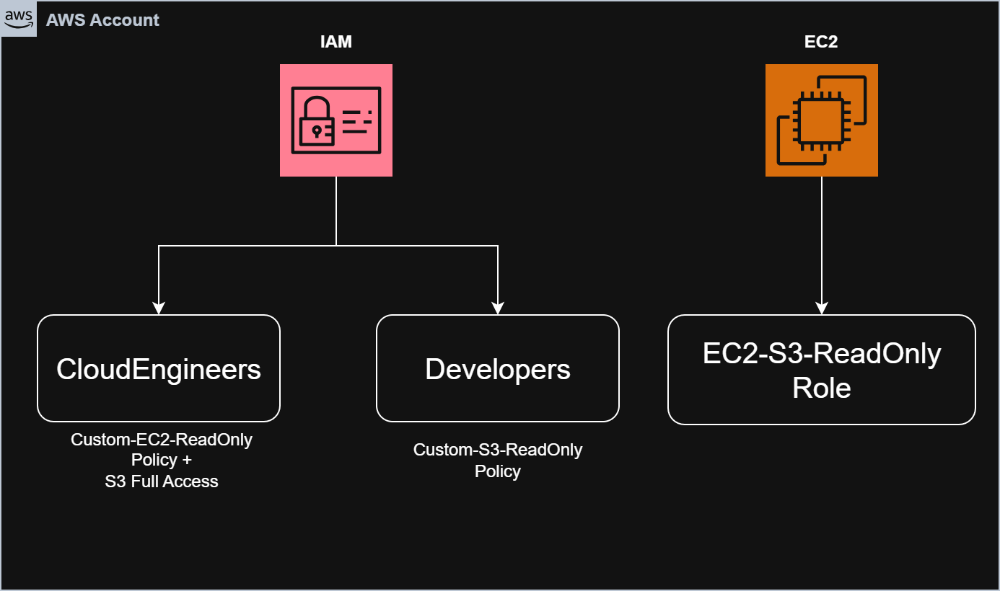

# Lab 06: IAM Least Privilege and Policy Management

## Objective

Learn how to implement the Principle of Least Privilege using IAM Users, Groups, Policies, and Roles.

This lab focuses on writing custom IAM policies, assigning permissions through groups, using IAM Roles for EC2, and troubleshooting AccessDenied errors.

---

# Architecture

---

# Real World Scenario

A company has:

```text
Developers
Cloud Engineers
Applications running on EC2
```

Requirements:

```text
Developers
→ Read-only S3 access

Cloud Engineers
→ Full S3 access
→ Read-only EC2 access

EC2 Application
→ Access AWS services using IAM Role

Nobody receives AdministratorAccess
```

---

# AWS Services Used

* IAM Users
* IAM Groups
* IAM Policies
* IAM Roles
* Amazon EC2
* Amazon S3
* AWS STS

---

# Security Concepts Covered

* Principle of Least Privilege
* Managed Policies
* Customer Managed Policies
* IAM Roles
* Temporary Credentials
* AccessDenied Troubleshooting

---

# Task 1: Create IAM Users

Created:

```text
dev-user
cloud-user
```

Configuration:

```text
AWS Management Console Access
Auto-generated Password
Require Password Reset at First Login
```

---

# Task 2: Create IAM Groups

Created:

```text
Developers
CloudEngineers
```

Added Users:

```text
dev-user
→ Developers

cloud-user
→ CloudEngineers
```

---

# Why Use Groups?

Bad Practice:

```text
100 Users
↓
100 Direct Permission Assignments
```

Good Practice:

```text
100 Users
↓
Groups
↓
Centralized Permission Management
```

---

# Task 3: Attach AWS Managed Policies

## Developers Group

Attached:

```text
AmazonS3ReadOnlyAccess
```

---

## CloudEngineers Group

Attached:

```text
AmazonS3FullAccess

AmazonEC2ReadOnlyAccess
```

---

# Learning

AWS Managed Policies are pre-built permission sets maintained by AWS.

Examples:

```text
AmazonS3ReadOnlyAccess
AmazonS3FullAccess
AmazonEC2ReadOnlyAccess
```

---

# Task 4: Create Custom S3 Read-Only Policy

## Policy Name

```text
Custom-S3-ReadOnly
```

## Policy JSON

```json
{
  "Version": "2012-10-17",
  "Statement": [
    {
      "Sid": "ListBuckets",
      "Effect": "Allow",
      "Action": [
        "s3:ListAllMyBuckets"
      ],
      "Resource": "*"
    },
    {
      "Sid": "ReadObjects",
      "Effect": "Allow",
      "Action": [
        "s3:GetObject",
        "s3:ListBucket"
      ],
      "Resource": "*"
    }
  ]
}
```

---

## Attached To

```text
Developers Group
```

---

## Removed

```text
AmazonS3ReadOnlyAccess
```

---

# Learning

Customer Managed Policies provide more control and support least-privilege access.

---

# Task 5: Create Custom EC2 Read-Only Policy

## Policy Name

```text
Custom-EC2-ReadOnly
```

## Policy JSON

```json
{
  "Version": "2012-10-17",
  "Statement": [
    {
      "Sid": "EC2ReadOnly",
      "Effect": "Allow",
      "Action": [
        "ec2:DescribeInstances",
        "ec2:DescribeVolumes",
        "ec2:DescribeSnapshots",
        "ec2:DescribeVpcs",
        "ec2:DescribeSubnets",
        "ec2:DescribeRouteTables",
        "ec2:DescribeSecurityGroups",
        "ec2:DescribeInternetGateways"
      ],
      "Resource": "*"
    }
  ]
}
```

---

## Attached To

```text
CloudEngineers
```

---

## Removed

```text
AmazonEC2ReadOnlyAccess
```

---

# Learning

Instead of granting hundreds of permissions through AWS managed policies, we grant only the permissions required.

This follows the Principle of Least Privilege.

---

# Task 6: Test Permissions

## Developer User

### Allowed

```text
View S3 Buckets
View S3 Objects
```

### Denied

```text
Create Bucket
Delete Bucket
Upload Objects
Delete Objects
```

---

## Cloud User

### Allowed

```text
View EC2 Resources
View Security Groups
View Volumes
View VPC Information
Full S3 Access
```

### Denied

```text
Launch EC2 Instance
Terminate EC2 Instance
Modify EC2 Resources
```

---

# Learning

IAM policies should always be tested after implementation.

---

# Task 7: Create IAM Role for EC2

## Role Name

```text
EC2-S3-ReadOnly-Role
```

---

## Trusted Entity

```text
EC2
```

---

## Permission Policy

```text
AmazonS3ReadOnlyAccess
```

---

# Understanding IAM Roles

An IAM Role consists of:

## Trust Policy

```text
Who can assume the role?
```

Example:

```text
EC2 Service
```

---

## Permission Policy

```text
What can the role do?
```

Example:

```text
Read S3 Objects
```

---

# Task 8: Attach IAM Role to EC2

Used existing EC2 instance.

Attached:

```text
EC2-S3-ReadOnly-Role
```

Verification:

```text
EC2
→ Security Tab
→ IAM Role
```

---

# Learning

Avoid:

```text
Access Keys
Secret Keys
Stored On Servers
```

Use:

```text
EC2
↓
IAM Role
↓
Temporary Credentials
```

---

# Task 9: Verify S3 Access From EC2

SSH into EC2.

Verify identity:

```bash
aws sts get-caller-identity
```

Output showed:

```text
assumed-role/EC2-S3-ReadOnly-Role
```

---

List buckets:

```bash
aws s3 ls
```

Success.

---

Verify credentials:

```bash
aws configure list
```

No access keys configured.

---

# Learning

AWS automatically provides temporary credentials through IAM Roles.

No manual credential management required.

---

# Task 10: Permission Troubleshooting Challenge

## Scenario

Removed:

```text
AmazonS3ReadOnlyAccess
```

from:

```text
EC2-S3-ReadOnly-Role
```

---

## Test

```bash
aws s3 ls
```

Result:

```text
AccessDenied
```

---

## Investigation

Checked:

```text
Network
AWS CLI
IAM Role
Policies
```

---

## Root Cause

Role no longer had permission to access S3.

---

## Fix

Reattached:

```text
AmazonS3ReadOnlyAccess
```

to:

```text
EC2-S3-ReadOnly-Role
```

---

## Verify

```bash
aws s3 ls
```

Success.

---

### Resolution

Changed to the correct folder containing the PEM file.

SSH succeeded immediately.

---

# Key Learnings

## IAM Users

```text
Used by Humans
```

---

## IAM Groups

```text
Manage Permissions Centrally
```

---

## Managed Policies

```text
Created By AWS
Maintained By AWS
```

---

## Customer Managed Policies

```text
Created By You
Customized Permissions
```

---

## IAM Roles

```text
Used By AWS Services
No Access Keys Required
```

---

## Principle Of Least Privilege

Grant:

```text
Only What Is Required
Nothing More
```

---

## AccessDenied Troubleshooting Process

```text
AccessDenied
↓
Who Is Making The Request?
↓
User Or Role?
↓
What Policies Are Attached?
↓
What Permission Is Missing?
↓
Fix Policy
↓
Retest
```

---

# Interview Notes

### Difference Between User And Role

User:

```text
Human Identity
```

Role:

```text
Temporary AWS Identity
```

---

### Why Use IAM Roles Instead Of Access Keys?

```text
More Secure
No Key Rotation
No Hardcoded Credentials
Temporary Credentials
```
---

### What Is Principle Of Least Privilege?

Grant only the minimum permissions required to perform a task.

---

# Status

```text
✅ Lab Completed

✅ IAM Users Created

✅ IAM Groups Created

✅ Managed Policies Tested

✅ Customer Managed Policies Created

✅ Custom Policy JSON Written

✅ IAM Role Created

✅ Role Attached To EC2

✅ S3 Access Verified Through Role

✅ AccessDenied Troubleshooting Performed

✅ Principle Of Least Privilege Implemented
```
