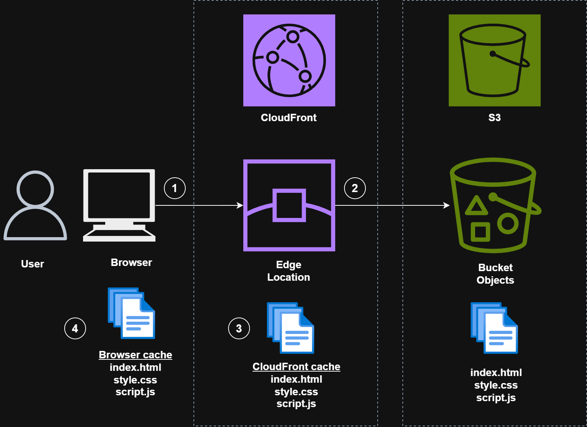
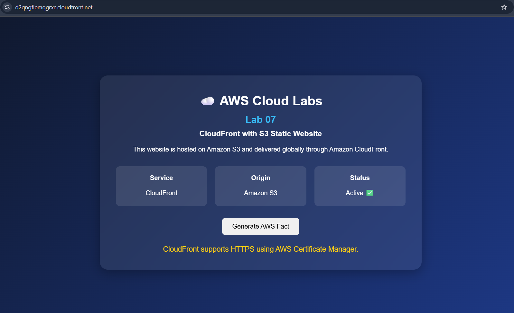
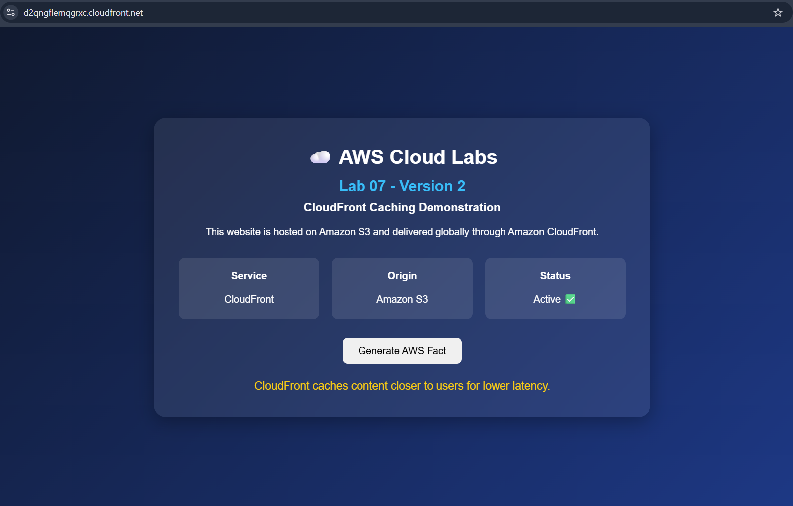
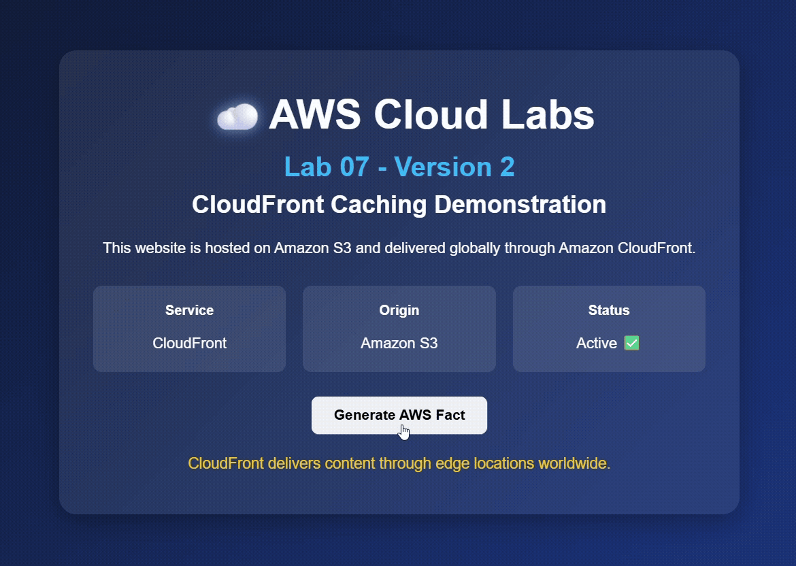

# Lab 07: CloudFront with S3 Static Website

## Objective

Deploy a static website using Amazon S3 and deliver it globally using Amazon CloudFront.

This lab demonstrates the modern and secure architecture of serving website content through CloudFront while keeping the S3 bucket private using Origin Access Control (OAC).

---

# Architecture


---

# Content Delivery Workflow

```text
User Request
      │
      ▼
CloudFront Edge Location
      │
      ├── Cache Hit
      │       │
      │       ▼
      │   Serve Cached Content
      │
      └── Cache Miss
              │
              ▼
        Fetch From S3
              │
              ▼
       Cache At Edge Location
              │
              ▼
          Return Response
```

---

# AWS Services Used

* Amazon S3
* Amazon CloudFront
* Origin Access Control (OAC)

---

# Concepts Covered

* Static Website Hosting
* Content Delivery Network (CDN)
* CloudFront Distribution
* Origin Access Control (OAC)
* Private S3 Bucket Architecture
* CloudFront Caching
* Cache Invalidation
* HTTPS Content Delivery

---

# Repository Structure

```text
level-100/
└── lab-07-cloudfront-with-s3-static-website/
    ├── README.md
    ├── architecture-diagram.png
    ├── screenshots/
    │   └── cloudfront-website.png
    └── website/
        ├── index.html
        ├── style.css
        └── script.js
```

---

# Task 1: Create Static Website Files

Created:

```text
website/
├── index.html
├── style.css
└── script.js
```

Features:

* Responsive UI
* Modern design
* Dynamic JavaScript functionality
* Random AWS facts generator

---

# Task 2: Create S3 Bucket

## Configuration

| Setting             | Value                   |
| ------------------- | ----------------------- |
| Bucket Name         | yourname-cloudfront-lab |
| Region              | us-east-1               |
| Object Ownership    | Bucket owner enforced   |
| Block Public Access | Enabled                 |
| Encryption          | SSE-S3                  |

---

# Important

The bucket remains private.

No public access is allowed.

---

# Why Keep Bucket Private?

Old Architecture:

```text
Internet
    │
    ▼
Public S3 Bucket
```

Modern Architecture:

```text
Internet
    │
    ▼
CloudFront
    │
    ▼
Private S3 Bucket
```

---

# Task 3: Upload Website Files

Uploaded:

```text
index.html
style.css
script.js
```

Files were uploaded directly to the root of the bucket.

Correct:

```text
bucket
├── index.html
├── style.css
└── script.js
```

Incorrect:

```text
bucket
└── website/
    ├── index.html
    ├── style.css
    └── script.js
```

---

# Task 4: Create CloudFront Distribution

## Origin Configuration

Selected:

```text
S3 Bucket Endpoint
```

Example:

```text
bucket-name.s3.us-east-1.amazonaws.com
```

Not:

```text
bucket-name.s3-website-us-east-1.amazonaws.com
```

---

## CloudFront Settings

| Setting                | Value                       |
| ---------------------- | --------------------------- |
| Origin Access          | Origin Access Control (OAC) |
| Viewer Protocol Policy | Redirect HTTP to HTTPS      |
| Allowed Methods        | GET, HEAD                   |
| Default Root Object    | index.html                  |
| Price Class            | North America and Europe    |

---

# Task 5: Configure Origin Access Control (OAC)

Created:

```text
Origin Access Control (OAC)
```

Purpose:

```text
Allow CloudFront to securely access
private S3 content.
```

---

# What is OAC?

Origin Access Control is the modern mechanism that allows CloudFront to securely access private S3 buckets.

Benefits:

* Private S3 bucket
* Improved security
* Fine-grained access control
* Replaces legacy OAI

---

# Task 6: Update S3 Bucket Policy

Added CloudFront-generated bucket policy.

Example:

```json
{
  "Version": "2008-10-17",
  "Statement": [
    {
      "Sid": "AllowCloudFrontServicePrincipal",
      "Effect": "Allow",
      "Principal": {
        "Service": "cloudfront.amazonaws.com"
      },
      "Action": "s3:GetObject",
      "Resource": "arn:aws:s3:::YOUR-BUCKET/*",
      "Condition": {
        "StringEquals": {
          "AWS:SourceArn": "arn:aws:cloudfront::ACCOUNT_ID:distribution/DISTRIBUTION_ID"
        }
      }
    }
  ]
}
```

---

# Learning

This policy means:

```text
Only this CloudFront distribution
can access this S3 bucket.
```

Direct internet access remains blocked.

---

# Task 7: Verify Website Access

Verified:

## CloudFront URL

```text
https://<distribution-domain>
```

Result:

```text
Website Loaded Successfully
```

Verified:

* HTML loaded
* CSS loaded
* JavaScript loaded
* HTTPS enabled

---

# Screenshot: Website Access Through CloudFront

The following screenshot shows the `index.html` page being successfully served through the CloudFront distribution URL.
Example Markdown for displaying the screenshot:




## Website Demonstration

The following GIF demonstrates the website being served through Amazon CloudFront, including the animated cloud icon and dynamic AWS facts generator.


---

## Direct S3 URL

Attempted:

```text
https://bucket-name.s3.amazonaws.com/index.html
```

Result:

```text
Access Denied
```

---

# Verification

```text
CloudFront URL
✅ Success

Direct S3 URL
❌ Access Denied
```

---

# Task 8: Test CloudFront Caching

Modified:

```html
<h2>Lab 07</h2>
```

to:

```html
<h2>Lab 07 - Version 2</h2>
```

Uploaded updated:

```text
index.html
```

Refreshed CloudFront URL.

Result:

```text
Old Content Displayed
```

---

# Learning

CloudFront continued serving cached content.

This behavior improves:

* Performance
* Availability
* Global latency

---

# Task 9: Perform Cache Invalidation

Created invalidation:

```text
/*
```

Waited until:

```text
Status = Completed
```

Refreshed website.

Result:

```text
New Content Displayed Successfully
```

---

# Cache Invalidation Workflow

```text
Updated File Uploaded To S3
            │
            ▼
CloudFront Still Serves Old Copy
            │
            ▼
Create Invalidation
            │
            ▼
CloudFront Removes Cached Content
            │
            ▼
CloudFront Fetches Latest Version
            │
            ▼
User Receives Updated Content
```

---

# Troubleshooting

## Issue 1: CloudFront Returned AccessDenied

### Error

```xml
<Error>
<Code>AccessDenied</Code>
<Message>Access Denied</Message>
</Error>
```

---

## Investigation

Checked:

* Distribution status
* Origin configuration
* Bucket policy
* Default root object

---

## Root Cause

CloudFront did not initially have permission to access objects in the S3 bucket.

---

## Resolution

Applied the correct CloudFront-generated bucket policy.

After deployment completed, website loaded successfully.

---

# Issue 2: CloudFront Served Old Content

## Symptoms

Updated files in S3.

Website still displayed old content.

---

## Root Cause

CloudFront cached objects at edge locations.

---

## Resolution

Created invalidation:

```text
/*
```

CloudFront fetched the latest files from S3.

---

# Key Learnings

## Amazon S3

* Create buckets
* Upload objects
* Secure buckets
* Configure bucket policies

---

## Amazon CloudFront

* Create distributions
* Configure origins
* Configure default root objects
* Configure HTTPS delivery
* Manage caching
* Create invalidations

---

## Security

* Keep S3 buckets private
* Use Origin Access Control
* Restrict direct bucket access

---

## Performance

CloudFront:

* Reduces latency
* Caches content globally
* Improves user experience

---

# Interview Notes

## What is CloudFront?

Amazon CloudFront is a global Content Delivery Network (CDN) service.

---

## What is a CDN?

A CDN caches content closer to users using edge locations worldwide.

---

## Why use CloudFront with S3?

Benefits:

* Lower latency
* Global distribution
* HTTPS support
* DDoS protection
* Improved security

---

## What is OAC?

Origin Access Control securely allows CloudFront to access private S3 buckets.

---

## Difference Between OAI and OAC

| OAI              | OAC                |
| ---------------- | ------------------ |
| Legacy           | Modern             |
| Older mechanism  | Recommended by AWS |
| Limited features | Enhanced security  |

---

## Why did CloudFront show old content after updating S3?

Because CloudFront cached the objects.

---

## How do you force CloudFront to fetch new content?

Create an invalidation.

Example:

```text
/*
```

---

## Why keep the S3 bucket private?

To ensure users access content only through CloudFront.

---

# Status

```text
✅ Lab Completed

✅ Static Website Created

✅ S3 Bucket Created

✅ CloudFront Distribution Created

✅ Origin Access Control Configured

✅ Private S3 Architecture Implemented

✅ Website Delivered Through CloudFront

✅ CloudFront Caching Tested

✅ Cache Invalidation Performed

✅ Real Troubleshooting Experience Gained
```
