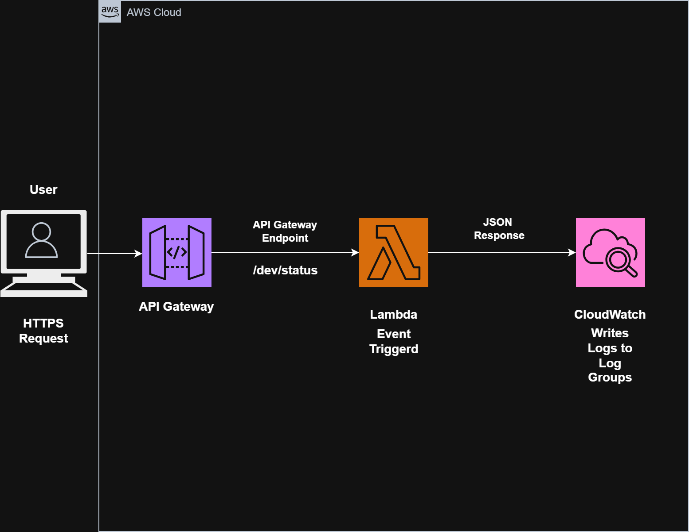
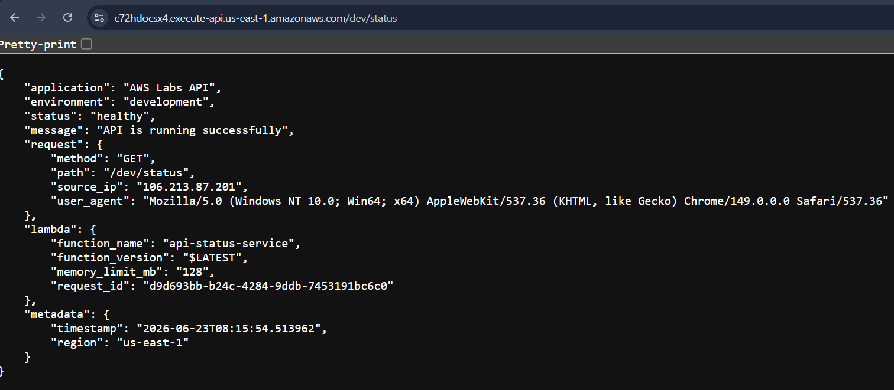

# Lab 10: API Gateway with Lambda

## Objective

Build a fully serverless REST API using Amazon API Gateway and AWS Lambda.

This lab demonstrates how to expose a Lambda function to the internet through API Gateway, process HTTP requests, return JSON responses, implement structured logging, and troubleshoot API failures.

---

# Architecture



---

# Request Flow

```text
Client Request
      │
      ▼
API Gateway Endpoint
      │
      ▼
Lambda Invocation
      │
      ▼
Process Business Logic
      │
      ▼
Generate JSON Response
      │
      ▼
Return HTTP Response
```

---

# AWS Services Used

* Amazon API Gateway
* AWS Lambda
* Amazon CloudWatch
* AWS IAM

---

# Concepts Covered

* HTTP APIs
* API Gateway Routes
* Lambda Integration
* JSON Responses
* Structured Logging
* Request Metadata
* Error Handling
* CloudWatch Monitoring
* API Troubleshooting

---

# Repository Structure

```text
level-100/
└── lab-10-api-gateway-with-lambda/
    ├── README.md
    ├── architecture-diagram.png
    ├── screenshots/
    └── lambda/
        └── lambda_function.py
```

---

# Task 1: Create Lambda Function

Created a Lambda function.

## Configuration

| Setting       | Value              |
| ------------- | ------------------ |
| Function Name | api-status-service |
| Runtime       | Python 3.x         |
| Architecture  | x86_64             |

---

## Execution Role

Selected:

```text
Create a new role with basic Lambda permissions
```

AWS automatically attached:

```text
AWSLambdaBasicExecutionRole
```

---

# Task 2: Create HTTP API Gateway

Created:

```text
HTTP API
```

API Gateway supports:

```text
REST API
HTTP API
WebSocket API
```

For this lab:

```text
HTTP API
```

was selected because it provides:

* Lower cost
* Lower latency
* Simpler configuration

---

# Task 3: Integrate API Gateway with Lambda

Integrated:

```text
API Gateway
        │
        ▼
api-status-service Lambda
```

This allows API Gateway to invoke Lambda whenever an HTTP request is received.

---

# Task 4: Create Route

Configured:

| Setting     | Value   |
| ----------- | ------- |
| HTTP Method | GET     |
| Route       | /status |

---

# Task 5: Create Stage

Created stage:

```text
dev
```

Enabled:

```text
Auto Deploy = Enabled
```

---

# API Endpoint

Example:

```text
https://abc123.execute-api.us-east-1.amazonaws.com/dev/status
```

---

# Task 6: Test API Endpoint

Opened the API endpoint in a browser.

Received JSON response:

```json
{
    "application": "AWS Labs API",
    "status": "healthy",
    "message": "API is running successfully"
}
```

---

# Initial Issue Encountered

Initially received:

```json
{
    "message": "Not Found"
}
```

---

# Root Cause

The API stage:

```text
dev
```

was missing from the URL.

Incorrect:

```text
https://api-id.execute-api.us-east-1.amazonaws.com/status
```

Correct:

```text
https://api-id.execute-api.us-east-1.amazonaws.com/dev/status
```

---

# Resolution

Updated the URL to include:

```text
/dev/status
```

The API returned the expected response successfully.

---

# Task 7: Build Production-Style Lambda API

Implemented a more professional Lambda function.

```python
import json
import logging
import os
from datetime import datetime


logger = logging.getLogger()
logger.setLevel(logging.INFO)


def lambda_handler(event, context):

    try:

        logger.info(f"Received Event: {json.dumps(event)}")

        application_name = os.environ.get(
            "APPLICATION_NAME",
            "AWS Labs API"
        )

        environment = os.environ.get(
            "ENVIRONMENT",
            "development"
        )

        request_context = event.get("requestContext", {})
        http_context = request_context.get("http", {})

        response = {

            "application": application_name,
            "environment": environment,
            "status": "healthy",
            "message": "API is running successfully",

            "request": {
                "method": http_context.get(
                    "method",
                    "Unknown"
                ),

                "path": event.get(
                    "rawPath",
                    "Unknown"
                ),

                "source_ip": http_context.get(
                    "sourceIp",
                    "Unknown"
                ),

                "user_agent": http_context.get(
                    "userAgent",
                    "Unknown"
                )
            },

            "lambda": {
                "function_name": context.function_name,
                "function_version": context.function_version,
                "memory_limit_mb": context.memory_limit_in_mb,
                "request_id": context.aws_request_id
            },

            "metadata": {
                "timestamp": datetime.utcnow().isoformat(),
                "region": os.environ.get(
                    "AWS_REGION",
                    "Unknown"
                )
            }
        }

        logger.info("Request processed successfully")

        return {
            "statusCode": 200,

            "headers": {
                "Content-Type": "application/json",
                "Access-Control-Allow-Origin": "*",
                "Access-Control-Allow-Headers": "Content-Type",
                "Access-Control-Allow-Methods": "GET"
            },

            "body": json.dumps(
                response,
                indent=4
            )
        }

    except Exception as error:

        logger.error(
            f"Application Error: {str(error)}"
        )

        return {
            "statusCode": 500,

            "headers": {
                "Content-Type": "application/json"
            },

            "body": json.dumps({
                "status": "error",
                "message": "Internal Server Error",
                "request_id": context.aws_request_id
            })
        }
```

---

# Sample Response

```json
{
    "application": "AWS Labs API",
    "environment": "development",
    "status": "healthy",
    "message": "API is running successfully",

    "request": {
        "method": "GET",
        "path": "/status",
        "source_ip": "203.122.xx.xx",
        "user_agent": "Mozilla/5.0"
    },

    "lambda": {
        "function_name": "api-status-service",
        "function_version": "$LATEST",
        "memory_limit_mb": "128",
        "request_id": "xxxxxxxx-xxxx"
    },

    "metadata": {
        "timestamp": "2026-06-23T12:30:15.123456",
        "region": "us-east-1"
    }
}
```

---

# Why This Code Is Production Ready

Features implemented:

* Structured JSON responses
* Logging using Python logging module
* Exception handling
* CORS headers
* Runtime metadata
* Request tracing
* Environment-based configuration

---

# Task 8: Review CloudWatch Logs

Opened:

```text
/aws/lambda/api-status-service
```

Observed:

```text
START RequestId

Received Event: {...}

Request processed successfully

END RequestId

REPORT RequestId
```

---

# CloudWatch REPORT Metrics

Observed:

```text
Duration

Billed Duration

Memory Size

Max Memory Used
```

Example:

```text
Duration: 21.52 ms

Memory Size: 128 MB

Max Memory Used: 76 MB
```

---

# Task 9: Test Failure Scenario

Intentionally added:

```python
raise Exception("Intentional API Failure")
```

Result:

```json
{
    "status": "error",
    "message": "Internal Server Error",
    "request_id": "xxxxxxxx"
}
```

HTTP Status:

```text
500 Internal Server Error
```

---

# Root Cause

Lambda intentionally threw an exception.

---

# Investigation

Checked:

```text
CloudWatch Logs
```

Observed:

```text
Application Error: Intentional API Failure
```

---

# Resolution

Removed:

```python
raise Exception("Intentional API Failure")
```

Redeployed Lambda.

Retested successfully.

---

# Troubleshooting Workflow

```text
API Failure
      │
      ▼
Check HTTP Response
      │
      ▼
Check CloudWatch Logs
      │
      ▼
Identify Root Cause
      │
      ▼
Fix Code
      │
      ▼
Deploy
      │
      ▼
Retest
```

---

# Screenshots





---

# Real-World Use Cases

* REST APIs
* Microservices
* Backend Services
* Health Check APIs
* Serverless Applications
* Mobile Backend APIs

---

# Key Learnings

## API Gateway

* Create HTTP APIs
* Configure Routes
* Create Stages
* Deploy APIs

---

## AWS Lambda

* Serverless Backend Logic
* Structured Logging
* JSON Responses

---

## CloudWatch

* Application Logging
* Monitoring
* Troubleshooting

---

## API Development

* HTTP Methods
* Status Codes
* Headers
* Request Metadata

---

# Notes

## What is Amazon API Gateway?

Amazon API Gateway is a managed service used to create, publish, secure, and monitor APIs.

---

## What are the types of APIs in API Gateway?

```text
REST API
HTTP API
WebSocket API
```

---

## Why choose HTTP API over REST API?

HTTP APIs provide:

* Lower cost
* Lower latency
* Simpler configuration

---

## How does API Gateway invoke Lambda?

```text
Client Request
      │
      ▼
API Gateway
      │
      ▼
Lambda Function
```

API Gateway sends an event payload to Lambda.

---

## What is a Stage in API Gateway?

A stage represents an environment.

Examples:

```text
dev
test
prod
```

---

## Where do you troubleshoot API failures?

First check:

```text
CloudWatch Logs
```

---

## What HTTP status code indicates success?

```text
200 OK
```

---

## What HTTP status code indicates server failure?

```text
500 Internal Server Error
```

---

# Status

```text
✅ Lab Completed

✅ Lambda Function Created

✅ HTTP API Created

✅ Route Configured

✅ API Publicly Exposed

✅ Production-Style API Implemented

✅ Structured Logging Added

✅ CloudWatch Logs Reviewed

✅ Failure Scenario Tested

✅ End-to-End Serverless Architecture Built
```
