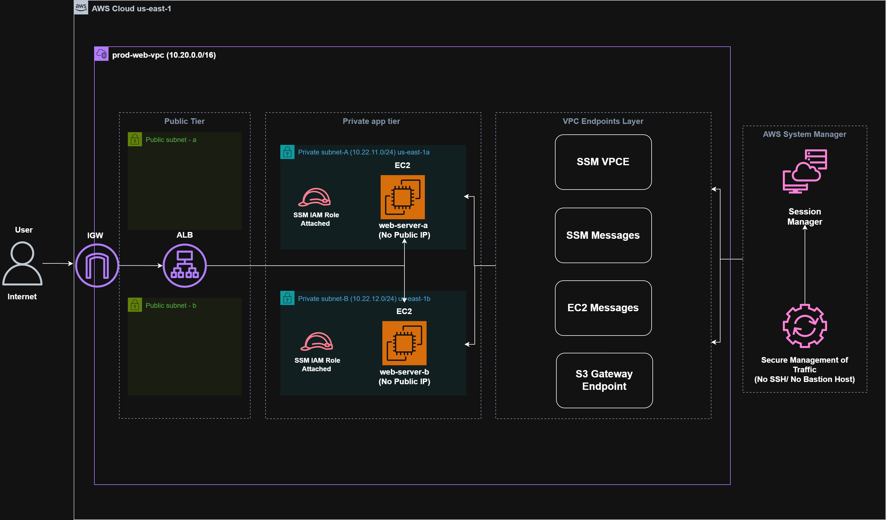
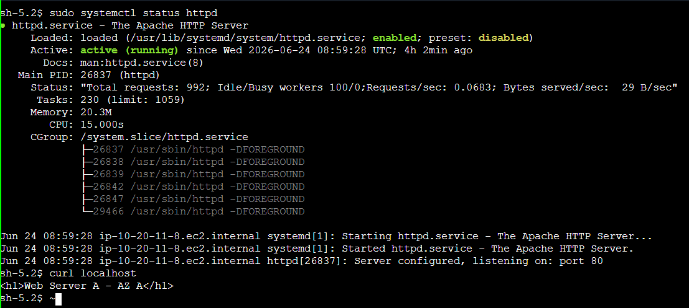
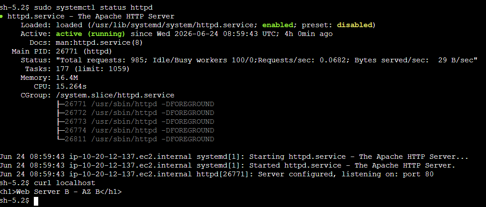
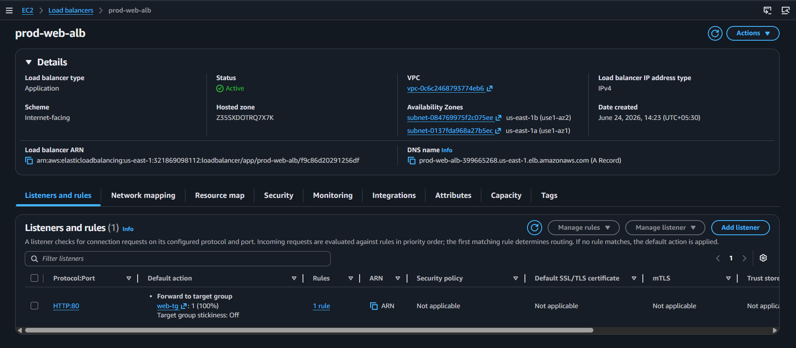
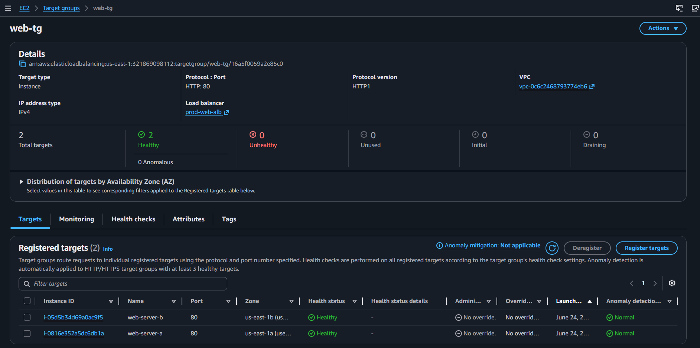
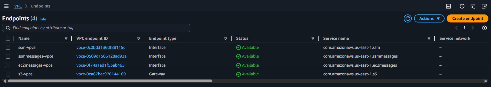

# Lab 01: Production Web Tier with Systems Manager

## Objective

Deploy a highly available and secure production-style web architecture using private EC2 instances managed through AWS Systems Manager without using SSH, Bastion Hosts, or NAT Gateway.

This lab demonstrates modern enterprise infrastructure practices where administrators securely manage private instances using Systems Manager and VPC Endpoints.

---

# Architecture


---

# Request Flow

```text
User Request
      │
      ▼
Application Load Balancer
      │
      ▼
Private EC2 Instances
      │
      ▼
Apache Web Server
```

---

# AWS Services Used

* Amazon VPC
* Amazon EC2
* AWS Systems Manager
* AWS IAM
* Application Load Balancer
* Target Groups
* VPC Interface Endpoints
* VPC Gateway Endpoints

---

# Concepts Covered

* Production VPC Design
* Public and Private Subnets
* Internet Gateway
* Route Tables
* Security Groups
* AWS Systems Manager
* Session Manager
* VPC Interface Endpoints
* Gateway Endpoints
* Application Load Balancer
* Target Groups
* High Availability
* Private EC2 Administration

---

# Real-World Scenario

An organization wants to deploy a secure web application architecture with the following requirements:

* No public EC2 instances
* No SSH access
* No Bastion Hosts
* Secure administrative access
* Highly available web tier
* Cost optimization by avoiding NAT Gateway

---

# Architecture Components

## VPC

| Resource | Value        |
| -------- | ------------ |
| Name     | prod-web-vpc |
| CIDR     | 10.20.0.0/16 |

---

## Subnets

| Name             | AZ         | CIDR          |
| ---------------- | ---------- | ------------- |
| public-subnet-a  | us-east-1a | 10.20.1.0/24  |
| public-subnet-b  | us-east-1b | 10.20.2.0/24  |
| private-subnet-a | us-east-1a | 10.20.11.0/24 |
| private-subnet-b | us-east-1b | 10.20.12.0/24 |

---

## Internet Gateway

| Resource         | Name         |
| ---------------- | ------------ |
| Internet Gateway | prod-web-igw |

---

## Route Tables

### Public Route Table

| Resource    | Name      |
| ----------- | --------- |
| Route Table | public-rt |

Routes:

| Destination  | Target       |
| ------------ | ------------ |
| 10.20.0.0/16 | local        |
| 0.0.0.0/0    | prod-web-igw |

Associated Subnets:

* public-subnet-a
* public-subnet-b

---

### Private Route Table

| Resource    | Name       |
| ----------- | ---------- |
| Route Table | private-rt |

Routes:

| Destination  | Target |
| ------------ | ------ |
| 10.20.0.0/16 | local  |

Associated Subnets:

* private-subnet-a
* private-subnet-b

---

# Security Groups

## ALB Security Group

### Name

```text
alb-sg
```

Inbound Rules:

| Type    | Source    |
| ------- | --------- |
| HTTP 80 | 0.0.0.0/0 |

---

## Web Server Security Group

### Name

```text
web-server-sg
```

Inbound Rules:

| Type    | Source |
| ------- | ------ |
| HTTP 80 | alb-sg |

No SSH access was configured.

---

## VPC Endpoint Security Group

### Name

```text
vpce-sg
```

Inbound Rules:

| Type      | Source       |
| --------- | ------------ |
| HTTPS 443 | 10.20.0.0/16 |

---

# IAM Configuration

Created IAM Role:

```text
EC2-SSM-Role
```

Attached Policy:

```text
AmazonSSMManagedInstanceCore
```

Purpose:

* Systems Manager connectivity
* Session Manager access
* Secure instance administration

---

# VPC Endpoints

## Interface Endpoints

### Systems Manager Endpoint

```text
com.amazonaws.us-east-1.ssm
```

Name:

```text
ssm-vpce
```

---

### Session Manager Endpoint

```text
com.amazonaws.us-east-1.ssmmessages
```

Name:

```text
ssmmessages-vpce
```

---

### EC2 Messages Endpoint

```text
com.amazonaws.us-east-1.ec2messages
```

Name:

```text
ec2messages-vpce
```

---

## Gateway Endpoint

### Amazon S3 Endpoint

```text
com.amazonaws.us-east-1.s3
```

Name:

```text
s3-vpce
```

Associated Route Table:

```text
private-rt
```

Purpose:

* Package installation
* Operating system updates
* Access Amazon Linux repositories

---

# EC2 Configuration

## Instance A

| Setting   | Value             |
| --------- | ----------------- |
| Name      | web-server-a      |
| AMI       | Amazon Linux 2023 |
| Type      | t3.micro          |
| Subnet    | private-subnet-a  |
| Public IP | Disabled          |
| IAM Role  | EC2-SSM-Role      |

---

## Instance B

| Setting   | Value             |
| --------- | ----------------- |
| Name      | web-server-b      |
| AMI       | Amazon Linux 2023 |
| Type      | t3.micro          |
| Subnet    | private-subnet-b  |
| Public IP | Disabled          |
| IAM Role  | EC2-SSM-Role      |

---

# Systems Manager Verification

Verified:

```text
Systems Manager
→ Managed Nodes
```

Observed:

```text
web-server-a → Online
web-server-b → Online
```

Successfully connected using:

```text
Session Manager
```

without:

```text
SSH Keys
Port 22
Public IP
Bastion Host
```

---

# Apache Installation

Installed Apache on both instances.

Commands used:

```bash
sudo dnf clean all
sudo dnf makecache
sudo dnf update -y
sudo dnf install httpd -y

sudo systemctl enable httpd
sudo systemctl start httpd
```

Created test pages.

## Web Server A

```bash
echo "<h1>Web Server A - AZ A</h1>" | sudo tee /var/www/html/index.html
```

---

## Web Server B

```bash
echo "<h1>Web Server B - AZ B</h1>" | sudo tee /var/www/html/index.html
```

---

# Target Group Configuration

| Setting           | Value     |
| ----------------- | --------- |
| Name              | web-tg    |
| Type              | Instances |
| Protocol          | HTTP      |
| Port              | 80        |
| Health Check Path | /         |

Registered Targets:

* web-server-a
* web-server-b

---

# Application Load Balancer Configuration

| Setting | Value                     |
| ------- | ------------------------- |
| Name    | prod-web-alb              |
| Type    | Application Load Balancer |
| Scheme  | Internet-facing           |
| VPC     | prod-web-vpc              |

Subnets:

* public-subnet-a
* public-subnet-b

Listener:

```text
HTTP:80 → web-tg
```

---

# Verification

Opened:

```text
ALB DNS Name
```

Observed:

```text
Web Server A - AZ A
Web Server B - AZ B
```

Successfully confirmed:

* High Availability
* Load Balancing
* Cross-AZ traffic distribution

---

# Troubleshooting

## Issue

Session Manager connection failed.

Error:

```text
dial tcp ...:443: i/o timeout
```

### Root Cause

Initial VPC Endpoint configuration issue.

### Resolution

Rebuilt networking and recreated all required VPC Endpoints.

---

## Issue

Target Group showed:

```text
Unhealthy
```

### Resolution

Waited for ALB health checks to complete.

Targets eventually transitioned to:

```text
Healthy
```

---

# Key Learnings

* Private EC2 instances can be managed without SSH.
* Systems Manager eliminates the need for Bastion Hosts.
* VPC Endpoints allow private communication with AWS services.
* S3 Gateway Endpoints can be used for package installation without NAT Gateway.
* Application Load Balancers can route traffic to private instances.
* High availability can be achieved across multiple Availability Zones.

---

# Notes

## Why use Systems Manager instead of SSH?

Benefits:

* No SSH keys
* No port 22 exposure
* No Bastion Host required
* Session auditing
* Improved security

---

## Why use VPC Endpoints?

VPC Endpoints allow private communication with AWS services without traversing the public internet.

---

## What are the required Systems Manager Interface Endpoints?

```text
com.amazonaws.us-east-1.ssm
com.amazonaws.us-east-1.ssmmessages
com.amazonaws.us-east-1.ec2messages
```

---

## Why was an S3 Gateway Endpoint required?

The S3 Gateway Endpoint allowed private EC2 instances to download packages and updates from Amazon Linux repositories without requiring a NAT Gateway.

---

## What is the purpose of an Application Load Balancer?

An ALB distributes incoming traffic across multiple targets, improving availability and fault tolerance.

---

# Suggested Screenshots

```text
assets/screenshots/
├── vpc-overview.png
├── managed-nodes-online.png
├── session-manager-connection.png
├── vpc-endpoints.png
├── target-group-healthy.png
├── alb-overview.png
├── apache-web-server-a.png
├── apache-web-server-b.png
└── architecture-overview.png
```
## Apache web server A


---
## Apache web server B


---
## SSM Connections web-server-a


---
## SSM Connections web-server-b


---
## ALB Overview 


---
## Target Group

---

## VPC Endpoints


--- 
# Status

```text
✅ Lab Completed

✅ Secure Private Infrastructure

✅ Systems Manager Connectivity

✅ No Bastion Host

✅ No NAT Gateway

✅ No Public EC2

✅ Application Load Balancer Configured

✅ High Availability Verified
```
