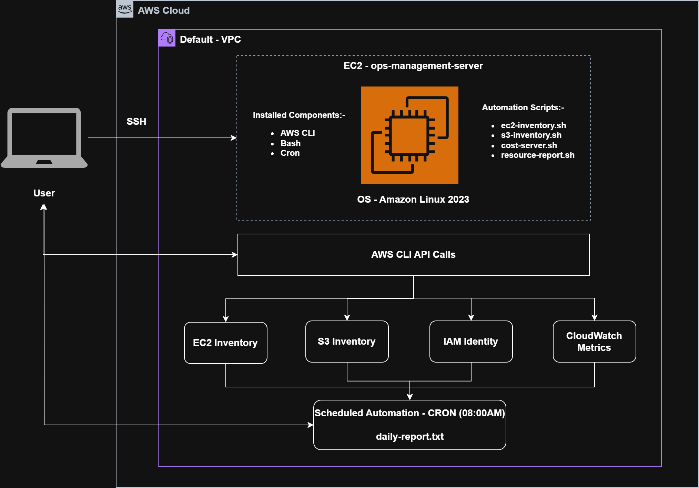
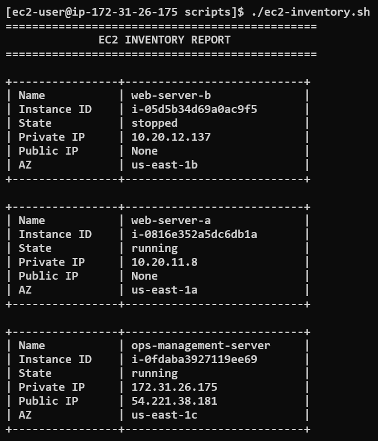
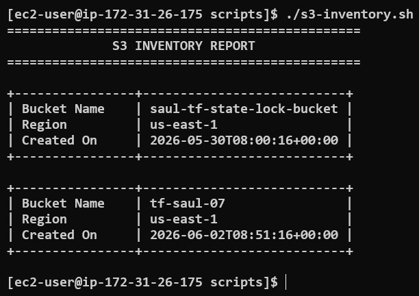
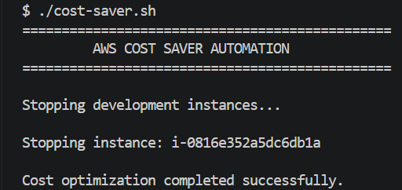
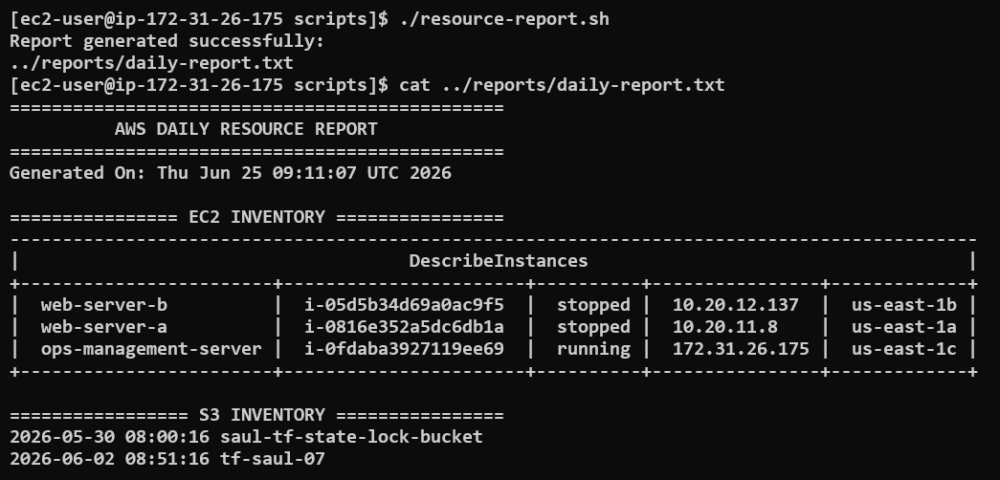
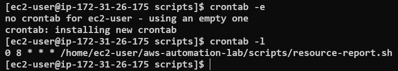

# Lab 02: AWS CLI Resource Inventory and Automation

## Objective

Build a centralized AWS operations workstation capable of automating resource inventory, cost optimization, and daily reporting using AWS CLI, Bash scripting, and Linux Cron.

This lab demonstrates how Cloud Engineers automate repetitive operational tasks in production environments.

---

## Architecture Diagram



---

# Real-World Scenario
* Generate an inventory of all EC2 instances.
* Generate an inventory of all S3 buckets.
* Automatically stop non-production resources to save costs.
* Generate a daily infrastructure report.
* Automate report generation.

Instead of manually checking the AWS Console every day, engineers use automation.

This lab simulates a real Cloud Operations environment.

---

# AWS Services Used

* Amazon EC2
* Amazon S3
* AWS IAM
* AWS CLI
* AWS STS
* Amazon CloudWatch
* Linux Cron

---

# Concepts Covered

* AWS CLI
* Bash Scripting
* JMESPath Queries
* AWS Resource Inventory
* Cost Optimization
* Linux Automation
* Cron Jobs
* AWS Operations
* Infrastructure Reporting

---

# Lab Environment

## Management Server

| Setting       | Value                 |
| ------------- | --------------------- |
| Name          | ops-management-server |
| OS            | Amazon Linux 2023     |
| Instance Type | t3.micro              |
| Network       | Default VPC           |
| Public IP     | Enabled               |

---

# AWS CLI Configuration

Verified AWS CLI installation:

```bash
aws --version
```

Configured credentials:

```bash
IAM Role (EC2-Operations-Role) - Best Practice Always Preffer
[Attached Permission Policy
AmazonEC2ReadOnlyAccess
AmazonS3ReadOnlyAccess]
or 
aws configure 
```

Verified connectivity:

```bash
aws sts get-caller-identity
```

---

# Script 1: EC2 Inventory Automation

## File

```text
scripts/ec2-inventory.sh
```

## Purpose

Generates an inventory report containing:

* Instance Name
* Instance ID
* Instance State
* Private IP
* Public IP
* Availability Zone

## Script
[ec2-inventory.sh](./scripts/ec2-inventory.sh)

---

# Script 2: S3 Inventory Automation

## File

```text
scripts/s3-inventory.sh
```

## Purpose

Generates an inventory report containing:

* Bucket Name
* Bucket Region
* Bucket Creation Date

## Script
[s3-inventory.sh](./scripts/s3-inventory.sh)

---

# Script 3: Cost Saver Automation

## File

```text
scripts/cost-saver.sh
```

## Purpose

Automatically stops running EC2 instances tagged:

```text
Environment=dev
```

to reduce infrastructure costs.

## Script

[cost-saver.sh](./scripts/cost-saver.sh)

---

# Script 4: Daily Resource Report

## File

```text
scripts/resource-report.sh
```

## Purpose

Generates a consolidated daily infrastructure report.

## Script

[resource-report.sh](./scripts/resource-report.sh)

---

# Cron Job Automation

Installed:

```bash
sudo dnf install cronie -y
```

Started service:

```bash
sudo systemctl enable crond
sudo systemctl start crond
```

Configured cron job:

```bash
0 8 * * * /home/ec2-user/aws-automation-lab/scripts/resource-report.sh
```

Purpose:

Generate a daily infrastructure report automatically every day at 08:00 AM.

---

# Verification

Verified:

```text
✓ AWS CLI connectivity
✓ EC2 inventory generation
✓ S3 inventory generation
✓ Cost optimization automation
✓ Daily report generation
✓ Cron scheduling
```

---

# Screenshots

## EC2 Inventory Report



---

## S3 Inventory Report



---

## Cost Saver Automation



---

## Daily Resource Report



---

## Cron Service Running



---

# Production Use Cases

Typical Cloud Operations tasks include:

* Resource inventory
* Cost optimization
* Compliance reporting
* Daily health checks
* Automated reporting
* Scheduled maintenance tasks

---

# Key Learnings

* AWS CLI can automate repetitive operational tasks.
* Bash scripting enhances AWS automation capabilities.
* JMESPath can filter and transform AWS CLI output.
* Tags enable automated cost optimization strategies.
* Cron can schedule recurring automation tasks.
* Cloud Engineers frequently automate inventory and reporting processes.

---

# Interview Questions

## Why use AWS CLI?

AWS CLI allows engineers to automate infrastructure operations and manage AWS resources programmatically.

---

## What is JMESPath?

JMESPath is a query language used to filter and extract specific information from JSON responses.

---

## Why are tags important?

Tags enable:

* Cost allocation
* Resource organization
* Automation
* Governance
* Access control

---

## How would you automate daily AWS reports?

A common approach is:

```text
AWS CLI + Bash Script + Cron
```

or in serverless architectures:

```text
EventBridge + Lambda + SNS
```

---

# Status

```text
✅ Lab Completed

✅ AWS CLI Configured

✅ Resource Inventory Automated

✅ Cost Optimization Implemented

✅ Daily Reporting Automated

✅ Linux Cron Configured
```
