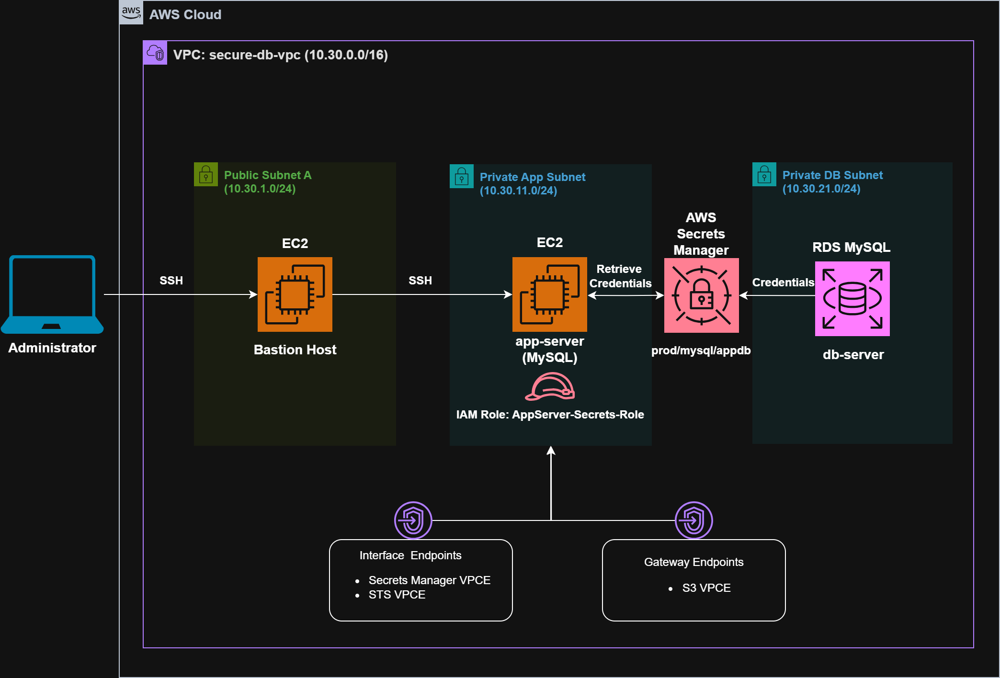
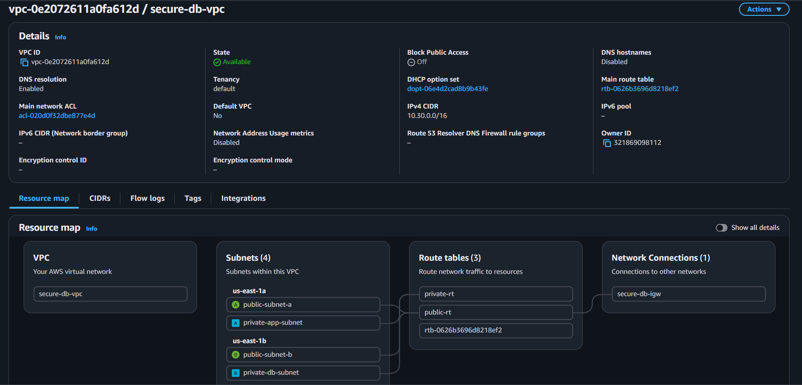
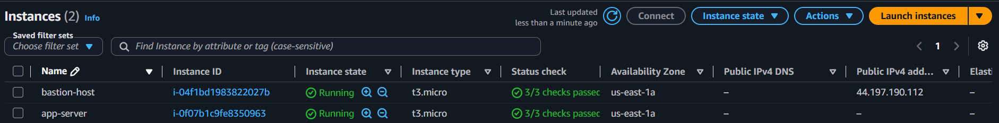
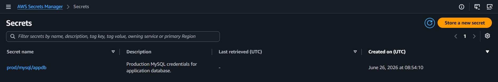
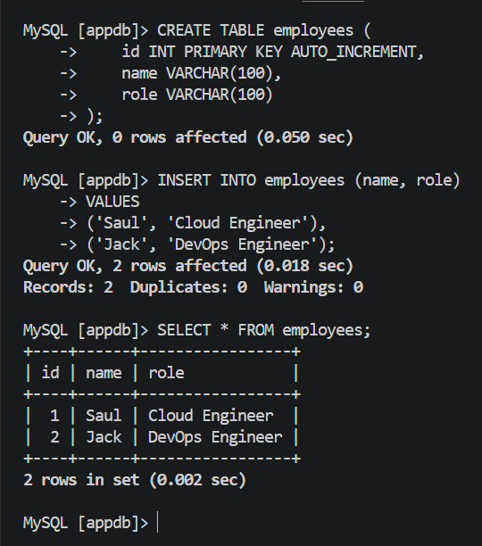

# Lab 03: Private RDS Access with Bastion and Secrets Manager

## Objective

Designed and implemented a secure three-tier architecture consisting of a Bastion Host, a private application server, and a private Amazon RDS MySQL database. Implemented secure credential management using AWS Secrets Manager and IAM roles to eliminate hardcoded database credentials.

---

## Architecture Diagram



---

## AWS Services Used

* Amazon VPC
* Amazon EC2
* Amazon RDS MySQL
* AWS Secrets Manager
* AWS IAM
* VPC Endpoints
* Amazon S3 Gateway Endpoint

---

## Concepts Covered

* Multi-tier VPC Architecture
* Public and Private Subnets
* Bastion Host Architecture
* Private RDS Deployment
* IAM Roles for EC2
* AWS Secrets Manager
* VPC Interface Endpoints
* S3 Gateway Endpoints
* Secure Database Connectivity
* Production Security Best Practices

---


## Architecture Overview

Implemented the following secure architecture:

```text
Administrator
      │
      ▼
Bastion Host (Public Subnet)
      │
      ▼
Application Server (Private Subnet)
      │
      ▼
AWS Secrets Manager
      │
      ▼
Amazon RDS MySQL (Private Subnet)
```

The architecture follows a production security model where:

* Only the Bastion Host is publicly accessible.
* The application server remains isolated in a private subnet.
* The RDS instance is deployed without public access.
* Database credentials are securely stored in AWS Secrets Manager.
* IAM roles provide temporary credentials to EC2 instances.

---
## Key Pair Transfer & Secure Access (SCP + SSH)

To securely access the private application server, the key pair (test.pem) must first be transferred from the local machine to the Bastion Host.

## Step 1: Copy Key Pair to Bastion Host
```bash 
scp -i test.pem test.pem ec2-user@<BASTION_PUBLIC_IP>:/home/ec2-user/
```

## Step 2: SSH into Bastion Host
```bash
ssh -i test.pem ec2-user@<BASTION_PUBLIC_IP>
```

## Step 3: Set Permissions on Key (Inside Bastion)
```bash
chmod 400 test.pem
```

## Step 4: Connect to Private Application Server
```bash
ssh -i test.pem ec2-user@<PRIVATE_APP_SERVER_IP>
```

## Validation
```bash 
whoami
hostname
```


This confirms successful secure access using the Bastion Host as a jump server.

---

## Network Configuration

### VPC

| Setting | Value         |
| ------- | ------------- |
| Name    | secure-db-vpc |
| CIDR    | 10.30.0.0/16  |

### Subnets

| Subnet Name        | Availability Zone | CIDR          |
| ------------------ | ----------------- | ------------- |
| public-subnet-a    | us-east-1a        | 10.30.1.0/24  |
| public-subnet-b    | us-east-1b        | 10.30.2.0/24  |
| private-app-subnet | us-east-1a        | 10.30.11.0/24 |
| private-db-subnet  | us-east-1b        | 10.30.21.0/24 |

### Route Tables

#### public-rt

| Destination | Target           |
| ----------- | ---------------- |
| 0.0.0.0/0   | Internet Gateway |

Associated with:

* public-subnet-a
* public-subnet-b

#### private-rt

| Destination  | Target |
| ------------ | ------ |
| 10.30.0.0/16 | local  |

Associated with:

* private-app-subnet
* private-db-subnet

---

## Security Groups

### bastion-sg

Inbound Rules:

| Type     | Source |
| -------- | ------ |
| SSH (22) | My IP  |

---

### app-server-sg

Inbound Rules:

| Type     | Source     |
| -------- | ---------- |
| SSH (22) | bastion-sg |

---

### rds-sg

Inbound Rules:

| Type         | Source        |
| ------------ | ------------- |
| MySQL (3306) | app-server-sg |

---

## EC2 Deployment

### Bastion Host

| Setting       | Value             |
| ------------- | ----------------- |
| Name          | bastion-host      |
| AMI           | Amazon Linux 2023 |
| Instance Type | t3.micro          |
| Subnet        | public-subnet-a   |
| Public IP     | Enabled           |

---

### Application Server

| Setting       | Value              |
| ------------- | ------------------ |
| Name          | app-server         |
| AMI           | Amazon Linux 2023  |
| Instance Type | t3.micro           |
| Subnet        | private-app-subnet |
| Public IP     | Disabled           |

---


## Amazon RDS Configuration

Created a private Amazon RDS MySQL database.

| Setting          | Value           |
| ---------------- | --------------- |
| Engine           | MySQL           |
| Identifier       | secure-mysql-db |
| Instance Type    | db.t3.micro     |
| Public Access    | No              |
| Initial Database | appdb           |

---

## AWS Secrets Manager

Stored database credentials securely.

Secret Name:

```text
prod/mysql/appdb
```

Stored values:

```text
username
password
host
database
```

---

## IAM Role Configuration

Created IAM Role:

```text
AppServer-Secrets-Role
```

Attached Policy:

```text
SecretsManagerReadWrite
```

Attached the role to:

```text
app-server
```

Verified role access:

```bash
aws sts get-caller-identity
```

---

## VPC Endpoints

Created the following Interface Endpoints:

| Endpoint        | Type      |
| --------------- | --------- |
| Secrets Manager | Interface |
| STS             | Interface |

Purpose:

Enable private EC2 instances to communicate with AWS APIs without requiring a NAT Gateway.

---

## S3 Gateway Endpoint

Created:

```text
s3-vpce
```

Purpose:

Allow private EC2 instances to access Amazon Linux package repositories without internet access.

This enabled package installation such as:

```bash
sudo dnf install mariadb105 -y
```

---

## Retrieving Secrets from Application Server

Retrieved the database credentials dynamically:

```bash
aws secretsmanager get-secret-value \
--secret-id prod/mysql/appdb \
--query SecretString \
--output text | jq .
```

Example output:

```json
{
  "username": "admin",
  "password": "********",
  "host": "secure-mysql-db.xxxxx.us-east-1.rds.amazonaws.com",
  "database": "appdb"
}
```

---

## Secure Database Connectivity

Installed MySQL client:

```bash
sudo dnf install mariadb105 -y
```

Set value of variable SECRET:
```bash
SECRET=$(aws secretsmanager get-secret-value \
--secret-id prod/mysql/appdb \
--query SecretString \
--output text)
```

Extracted credentials:

```bash
DB_USER=$(echo $SECRET | jq -r '.username')
DB_PASSWORD=$(echo $SECRET | jq -r '.password')
DB_HOST=$(echo $SECRET | jq -r '.host')
DB_NAME=$(echo $SECRET | jq -r '.database')
```

Connected securely:

```bash
mysql -h $DB_HOST -u $DB_USER -p$DB_PASSWORD $DB_NAME
```

---

## Database Validation

Created sample table:

```sql
CREATE TABLE employees (
    id INT PRIMARY KEY AUTO_INCREMENT,
    name VARCHAR(100),
    role VARCHAR(100)
);
```

Inserted records:

```sql
INSERT INTO employees (name, role)
VALUES
('Saul', 'Cloud Engineer'),
('Jack', 'DevOps Engineer');
```

Validated data:

```sql
SELECT * FROM employees;
```

---

## Verification

Successfully verified:

```text
✓ Bastion Host Connectivity
✓ Private Application Server Access
✓ RDS Connectivity
✓ IAM Role Authentication
✓ Secrets Retrieval
✓ VPC Endpoint Connectivity
✓ Secure Database Access
```

---

## Screenshots

### VPC Architecture Overview



### EC2 Tier Deployment



### Secrets Manager Secret




### Private RDS Connectivity



---

## Key Learnings

* Private databases should never be publicly accessible.
* IAM roles eliminate the need for long-term AWS credentials.
* AWS Secrets Manager provides secure credential storage.
* Private EC2 instances require NAT Gateway or VPC Endpoints to access AWS services.
* Bastion Hosts provide controlled administrative access to private infrastructure.
* VPC Endpoints improve security by keeping AWS API traffic within the AWS network.

---

## Production Considerations

Modern production environments often replace Bastion Hosts with:

```text
AWS Systems Manager Session Manager
```

Additional production enhancements include:

* Multi-AZ RDS deployments
* Automated secret rotation
* Read replicas
* AWS Backup integration
* CloudWatch monitoring and alarms
* Infrastructure as Code using Terraform

---

##  Notes

### Why should RDS not be publicly accessible?

To reduce the attack surface and ensure that database access is restricted to trusted application layers.

### Why use AWS Secrets Manager?

To securely store, retrieve, and rotate sensitive credentials without hardcoding them in applications.

### Why are VPC Endpoints important?

They allow private resources to access AWS services securely without internet access.

### Why use IAM Roles with EC2?

IAM roles provide temporary credentials automatically, eliminating the need to manage static access keys.

---

## Status

```text
✅ Lab Completed

✅ Secure Multi-Tier Architecture Implemented

✅ Private RDS Successfully Connected

✅ Secrets Manager Integrated

✅ Production Security Best Practices Applied
```
