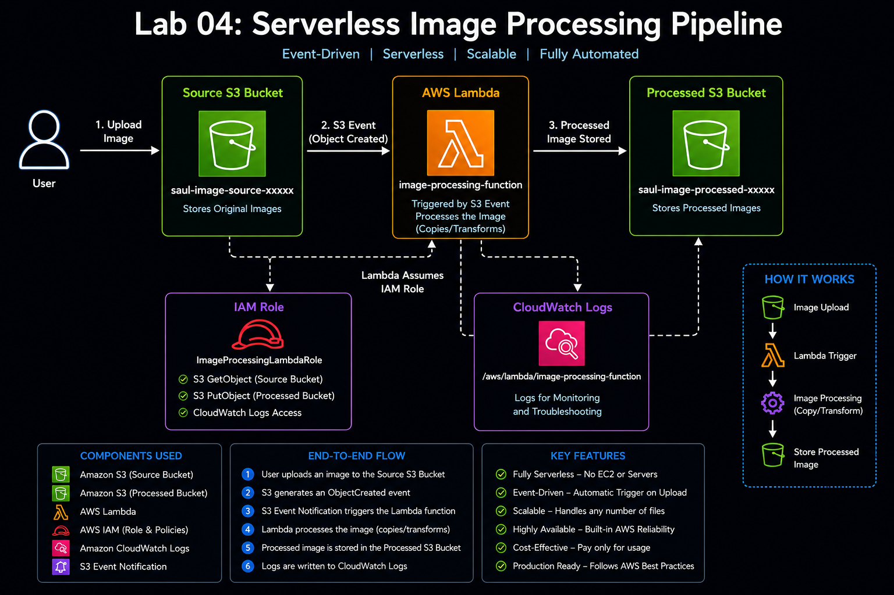
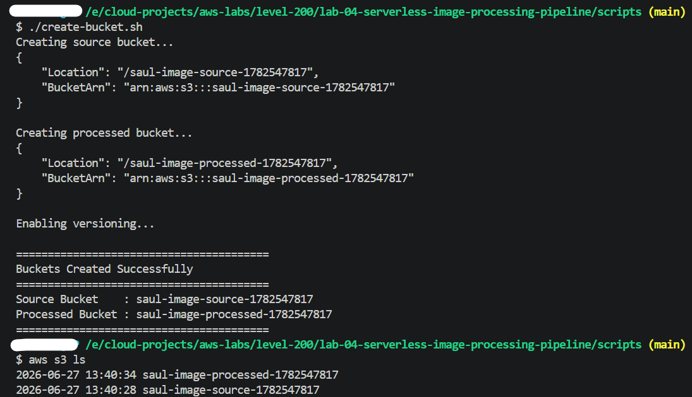
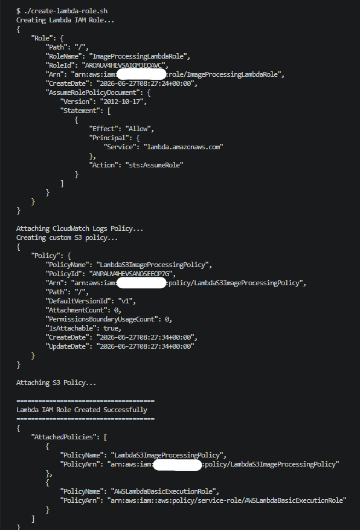
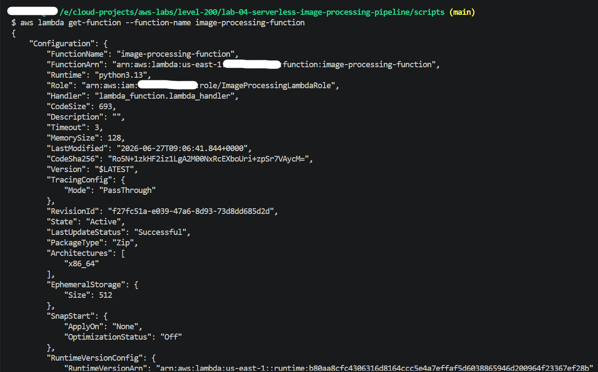
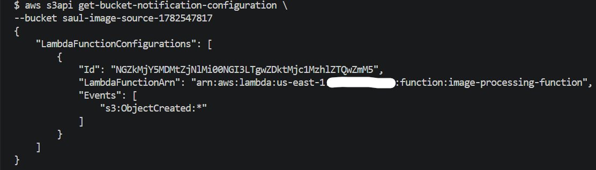
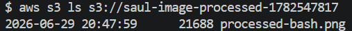

# Lab 04: Serverless Image Processing Pipeline

## Objective

Built a fully automated, event-driven serverless image processing pipeline using Amazon S3, AWS Lambda, and IAM. Whenever an image is uploaded to the source bucket, Amazon S3 automatically triggers a Lambda function that processes the image and stores the processed copy in a destination bucket.

---

## Architecture Diagram



---

## AWS Services Used

* Amazon S3
* AWS Lambda
* AWS IAM
* Amazon CloudWatch Logs

---

## Concepts Covered

* Serverless Computing
* Event-Driven Architecture
* Amazon S3 Event Notifications
* AWS Lambda
* IAM Roles and Policies
* CloudWatch Logs
* AWS CLI Automation
* Bash Scripting

---

## Repository Structure

```text
level-200/
└── lab-04-serverless-image-processing-pipeline/
    ├── README.md
    ├── assets/
    │   ├── serverless-image-processing-pipeline-architecture.png
    │   └── screenshots/
    │       ├── s3-buckets-created-cli.png
    │       ├── lambda-execution-role-created.png
    │       ├── lambda-function-created-cli.png
    │       ├── s3-event-notification-configured.png
    │       └── image-processing-success.png
    │
    ├── scripts/
    │   ├── create-buckets.sh
    │   ├── create-lambda-role.sh
    │   ├── create-lambda.sh
    │   └── configure-lambda-permission.sh
    │
    ├── policies/
    │   ├── lambda-trust-policy.json
    │   └── lambda-s3-policy.json
    │
    ├── lambda/
    │   ├── lambda_function.py
    │   ├── lambda.zip
    │   └── notification.json
    │
    └── sample-images/
```

---

## Architecture Overview

Implemented the following event-driven architecture:

```text
User
   │
   ▼
Source S3 Bucket
   │
   │ S3 Event Notification
   ▼
AWS Lambda Function
   │
   ▼
Processed S3 Bucket
```

The architecture automatically processes files whenever new objects are uploaded to the source bucket.

---

## Project Implementation Steps

### Step 1: Create S3 Buckets

* Created two S3 buckets: one for source images and one for processed images.
* Enabled versioning on both buckets to prevent accidental data loss.

### Step 2: Configure IAM Role

* Created a Lambda execution role named `ImageProcessingLambdaRole`.
* Attached AWS managed policy for CloudWatch logging.
* Created and attached a custom policy to allow S3 read and write access.

### Step 3: Develop Lambda Function

* Created a Lambda function named `image-processing-function`.
* Used Python runtime.
* Implemented logic to:

  * Read uploaded image details from S3 event
  * Copy the image to the processed bucket with a new name
  * Log execution details to CloudWatch

### Step 4: Package and Deploy Lambda

* Packaged the Lambda function code into a zip file.
* Deployed the Lambda function using AWS CLI.

### Step 5: Configure S3 Event Notification

* Configured the source bucket to trigger the Lambda function on object creation events.
* Used event type:

```text
s3:ObjectCreated:*
```

### Step 6: Grant Invocation Permission

* Allowed S3 to invoke the Lambda function by configuring appropriate permissions.

### Step 7: Test the Pipeline

* Uploaded a sample image to the source bucket.
* Verified that the processed image was automatically created in the destination bucket.

### Step 8: Monitor Using CloudWatch

* Checked Lambda execution logs in CloudWatch to confirm successful processing.

---

## Note on Automation Scripts

All automation scripts used for creating resources and configuring the pipeline were added to the `scripts/` folder, where all scripts belong. These scripts were used to streamline and automate the setup process.

---

## Storage Layer

Created two Amazon S3 buckets:

| Bucket           | Purpose                         |
| ---------------- | ------------------------------- |
| Source Bucket    | Stores original uploaded images |
| Processed Bucket | Stores processed images         |

Versioning was enabled on both buckets to protect against accidental deletion and overwrites.

---

## IAM Configuration

Created a Lambda execution role:

```text
ImageProcessingLambdaRole
```

Attached policies:

* AWSLambdaBasicExecutionRole
* LambdaS3ImageProcessingPolicy

The role provides permissions to:

* Read objects from the source bucket
* Write objects to the processed bucket
* Write logs to CloudWatch

---

## Trust Policy

### policies/lambda-trust-policy.json

```json
{
  "Version": "2012-10-17",
  "Statement": [
    {
      "Effect": "Allow",
      "Principal": {
        "Service": "lambda.amazonaws.com"
      },
      "Action": "sts:AssumeRole"
    }
  ]
}
```

---

## Custom IAM Policy

### policies/lambda-s3-policy.json

```json
{
  "Version": "2012-10-17",
  "Statement": [
    {
      "Effect": "Allow",
      "Action": [
        "s3:GetObject",
        "s3:PutObject"
      ],
      "Resource": "*"
    }
  ]
}
```

---

## Lambda Function

Created the Lambda function:

```text
image-processing-function
```

Runtime:

```text
Python 3.13
```

Purpose:

* Receive S3 event notifications
* Retrieve uploaded object information
* Copy the object to the processed bucket
* Generate execution logs

---

## Lambda Source Code

### lambda/lambda_function.py

```python
import json
import urllib.parse
import boto3

s3 = boto3.client('s3')

DESTINATION_BUCKET = 'processed-bucket-name'

def lambda_handler(event, context):

    source_bucket = event['Records'][0]['s3']['bucket']['name']

    source_key = urllib.parse.unquote_plus(
        event['Records'][0]['s3']['object']['key']
    )

    destination_key = f"processed-{source_key}"

    copy_source = {
        'Bucket': source_bucket,
        'Key': source_key
    }

    s3.copy_object(
        Bucket=DESTINATION_BUCKET,
        CopySource=copy_source,
        Key=destination_key
    )

    return {
        'statusCode': 200,
        'body': json.dumps('Image processed successfully')
    }
```

---

## Testing the Pipeline

Uploaded a sample image:

```bash
aws s3 cp sample.jpg s3://<SOURCE_BUCKET_NAME>
```

Verified processed image creation:

```bash
aws s3 ls s3://<PROCESSED_BUCKET_NAME>
```

Expected output:

```text
processed-sample.jpg
```

---

## CloudWatch Monitoring

Verified Lambda execution logs:

```bash
aws logs tail /aws/lambda/image-processing-function --follow
```

Sample logs:

```text
Source Bucket: saul-image-source-xxxxx
Source Object: sample.jpg
Copied to processed bucket
```

---

## Verification

Successfully verified:

```text
✓ S3 Bucket Automation
✓ Versioning Enabled
✓ IAM Role Automation
✓ Lambda Deployment Automation
✓ S3 Event Notification
✓ Event-Driven Processing
✓ CloudWatch Logging
✓ End-to-End Serverless Workflow
```

---

## Screenshots

### S3 Buckets Created Using AWS CLI



### Lambda Execution Role Created


### Lambda Function Created Using AWS CLI


### S3 Event Notification Configured


### Image Processing Successfully Completed

---

## Key Learnings

* Serverless architectures eliminate infrastructure management.
* Amazon S3 can trigger Lambda functions automatically.
* Event-driven architectures improve automation and scalability.
* IAM roles provide secure permission management.
* CloudWatch Logs are essential for troubleshooting Lambda functions.
* AWS CLI and Bash scripting improve repeatability and operational efficiency.

---

## Notes

### What is an event-driven architecture?

An architecture where events generated by services trigger automated actions.

### How does Amazon S3 trigger Lambda?

S3 Event Notifications generate events whenever specified object actions occur and invoke the configured Lambda function.

### Why use AWS Lambda?

Lambda provides serverless compute that automatically scales and removes infrastructure management overhead.

### Why use CloudWatch Logs with Lambda?

CloudWatch Logs help monitor, troubleshoot, and debug serverless applications.

---

## Status

```text
✅ Lab Completed

✅ Event-Driven Architecture Implemented

✅ Fully Automated Serverless Workflow Built

✅ Production-Oriented AWS CLI Automation Applied
```
