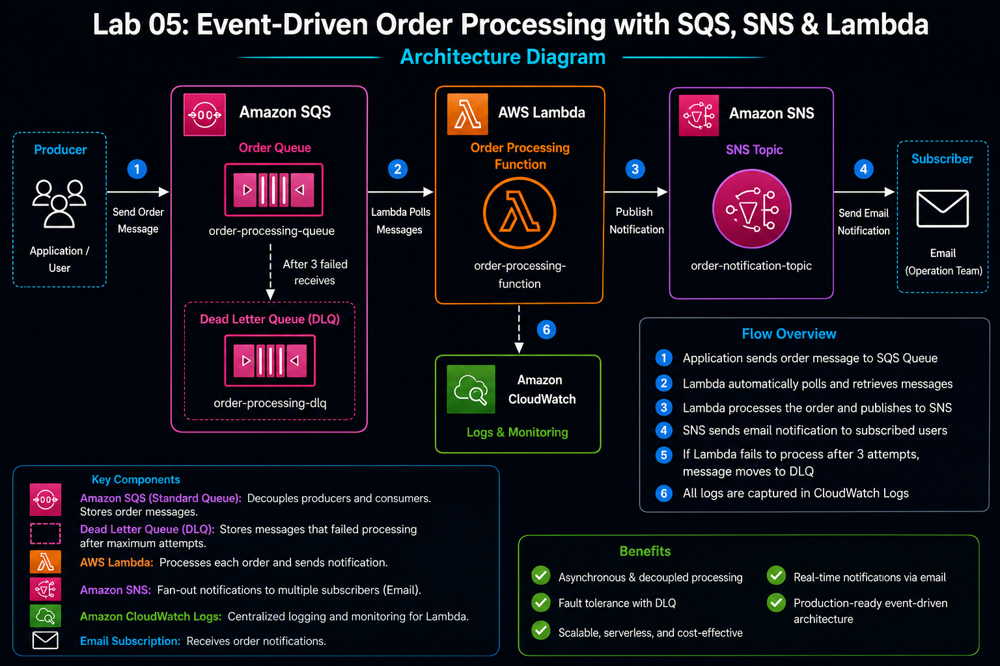
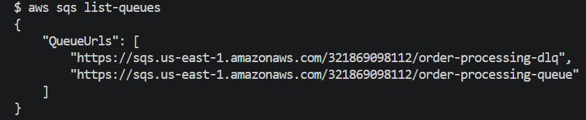
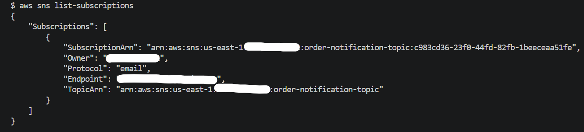
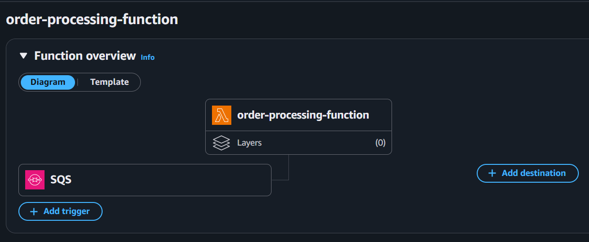
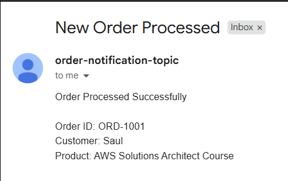
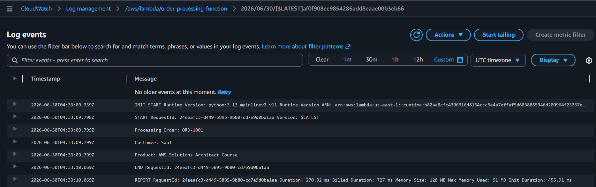

# Lab 05: Event-Driven Order Processing with SQS, SNS and Lambda

## Objective

Built a production-style asynchronous order processing system using Amazon SQS, AWS Lambda, and Amazon SNS. Implemented an event-driven architecture where order messages are processed automatically and notifications are sent to subscribers.

---

## Architecture Diagram

Diagram Name:





---

## AWS Services Used

* Amazon SQS
* Amazon SNS
* AWS Lambda
* AWS IAM
* Amazon CloudWatch Logs

---

## Concepts Covered

* Event-Driven Architecture
* Asynchronous Processing
* Decoupled Systems
* Amazon SQS
* Dead Letter Queues (DLQ)
* Amazon SNS
* Lambda Event Source Mapping
* CloudWatch Monitoring
* Serverless Computing

---

## Repository Structure

```text
level-200/
└── lab-05-event-driven-order-processing-with-sqs-sns-and-lambda/
    ├── README.md
    ├── assets/
    │   ├── event-driven-order-processing-with-sqs-sns-and-lambda-architecture.png
    │   └── screenshots/
    │       ├── sqs-queues-created.png
    │       ├── sns-topic-subscription-confirmed.png
    │       ├── lambda-role-created.png
    │       ├── order-processing-lambda-created.png
    │       ├── sqs-lambda-trigger-configured.png
    │       ├── order-processing-email-received.png
    │       └── cloudwatch-order-processing-logs.png
    │
    ├── lambda/
    │   ├── lambda_function.py
    │   └── lambda.zip
    │
    ├── sample-events/
    │   └── order.json
    │
    └── scripts/
        ├── verify-resources.sh
        └── cleanup.sh
```

---

## Architecture Overview

Implemented the following asynchronous workflow:

```text
Application
     │
     ▼
Amazon SQS Queue
     │
     ▼
AWS Lambda Function
     │
     ▼
Amazon SNS Topic
     │
     ▼
Email Notification
```

The architecture decouples message producers from consumers and enables reliable background processing.

---

## Project Implementation Steps

### Step 1: Create Messaging Layer

Created the following Amazon SQS queues:

| Queue Name             | Purpose                        |
| ---------------------- | ------------------------------ |
| order-processing-queue | Stores incoming order messages |
| order-processing-dlq   | Stores failed messages         |

Configured:

```text
Maximum Receives: 3
```

Messages that fail processing after three attempts are automatically moved to the Dead Letter Queue.

---

### Step 2: Create SNS Topic

Created an SNS topic:

```text
order-notification-topic
```

Created an email subscription and confirmed the subscription from the email inbox.

Purpose:

* Send order processing notifications
* Notify operations teams
* Demonstrate fan-out messaging

---

### Step 3: Create Lambda Execution Role

Created IAM role:

```text
OrderProcessingLambdaRole
```

Attached the following policies:

* AWSLambdaBasicExecutionRole
* AWSLambdaSQSQueueExecutionRole
* AmazonSNSFullAccess

Purpose:

| Policy                         | Usage                        |
| ------------------------------ | ---------------------------- |
| AWSLambdaBasicExecutionRole    | Write logs to CloudWatch     |
| AWSLambdaSQSQueueExecutionRole | Read messages from SQS       |
| AmazonSNSFullAccess            | Publish notifications to SNS |

---

### Step 4: Create Lambda Function

Created Lambda function:

```text
order-processing-function
```

Configuration:

| Setting        | Value                     |
| -------------- | ------------------------- |
| Runtime        | Python 3.13               |
| Architecture   | x86_64                    |
| Execution Role | OrderProcessingLambdaRole |

---

### Step 5: Develop Order Processing Logic

Implemented Lambda logic to:

* Receive SQS messages
* Parse order details
* Log processing information
* Publish notification to SNS

---

## Lambda Source Code

### lambda/lambda_function.py

```python
import json
import boto3

sns = boto3.client('sns')

SNS_TOPIC_ARN = "REPLACE_WITH_YOUR_SNS_TOPIC_ARN"

def lambda_handler(event, context):

    for record in event['Records']:

        message = json.loads(record['body'])

        order_id = message['order_id']
        customer = message['customer']
        product = message['product']

        print(f"Processing Order: {order_id}")
        print(f"Customer: {customer}")
        print(f"Product: {product}")

        notification = (
            f"Order Processed Successfully\n\n"
            f"Order ID: {order_id}\n"
            f"Customer: {customer}\n"
            f"Product: {product}"
        )

        sns.publish(
            TopicArn=SNS_TOPIC_ARN,
            Subject="New Order Processed",
            Message=notification
        )

    return {
        'statusCode': 200,
        'body': 'Order processed successfully'
    }
```

---

### Step 6: Configure SQS Trigger

Configured Lambda trigger:

| Setting      | Value                  |
| ------------ | ---------------------- |
| Trigger Type | Amazon SQS             |
| Queue        | order-processing-queue |
| Batch Size   | 10                     |

This created an Event Source Mapping between SQS and Lambda.

---

### Step 7: Test the Application

Created sample order event.

### sample-events/order.json

```json
{
  "order_id": "ORD-1001",
  "customer": "Saul",
  "product": "AWS Solutions Architect Course"
}
```

Sent message:

```bash
aws sqs send-message \
--queue-url <QUEUE_URL> \
--message-body file://sample-events/order.json
```

---

### Step 8: Verify Processing

Verified:

* Email notification received successfully.
* CloudWatch logs generated successfully.
* Queue became empty after processing.

Validation command:

```bash
aws sqs get-queue-attributes \
--queue-url <QUEUE_URL> \
--attribute-names ApproximateNumberOfMessages
```

Expected:

```text
ApproximateNumberOfMessages = 0
```

---

## CloudWatch Monitoring

Verified Lambda execution logs from:

```text
/aws/lambda/order-processing-function
```

Sample output:

```text
Processing Order: ORD-1001
Customer: Saul
Product: AWS Solutions Architect Course
```

---

## Verification

Successfully verified:

```text
✓ SQS Queue Creation
✓ Dead Letter Queue Configuration
✓ SNS Topic Creation
✓ Email Subscription Confirmation
✓ Lambda Deployment
✓ SQS Trigger Configuration
✓ Order Processing
✓ Email Notification Delivery
✓ CloudWatch Logging
✓ End-to-End Event Flow
```

---

## Screenshots

### SQS Queues Created



### SNS Subscription Confirmed



### SQS Trigger Configured



### Email Notification Received



### CloudWatch Logs



---

## Key Learnings

* SQS decouples producers and consumers.
* Lambda can automatically poll SQS queues.
* SNS enables notification fan-out patterns.
* Dead Letter Queues improve reliability.
* Event-driven architectures improve scalability.
* CloudWatch Logs are essential for troubleshooting serverless applications.

---


##  Notes

### Why use Amazon SQS?

SQS decouples application components and enables asynchronous processing.

### What is a Dead Letter Queue?

A DLQ stores messages that fail processing after a configured number of retries.

### How does Lambda process SQS messages?

Lambda continuously polls SQS and invokes the function when messages are available.

### Why use SNS?

SNS enables fan-out messaging and real-time notifications to multiple subscribers.

### What is asynchronous processing?

A pattern where producers and consumers operate independently without waiting for immediate responses.

---

## Status

```text
✅ Lab Completed

✅ Event-Driven Architecture Implemented

✅ Asynchronous Order Processing Successfully Built

✅ Production Messaging Patterns Applied
```
