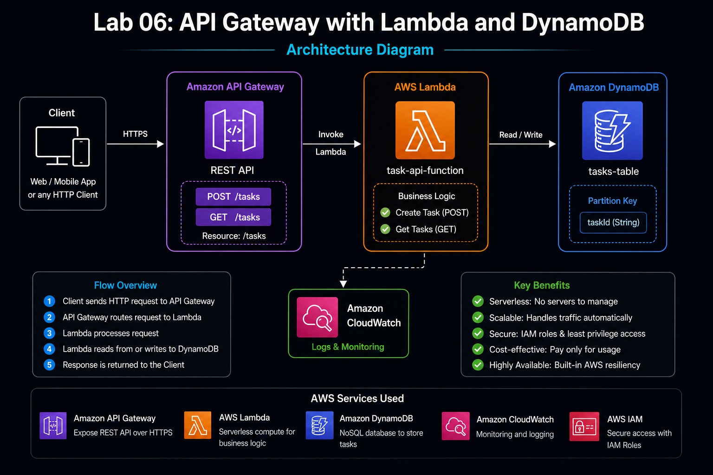
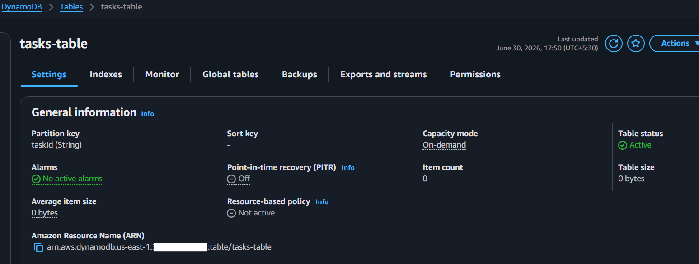
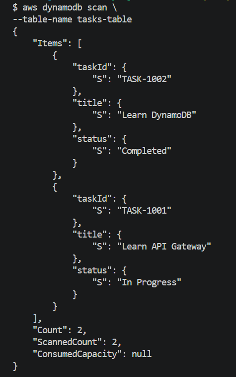
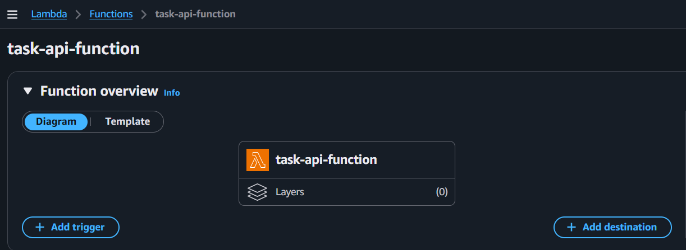
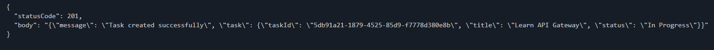
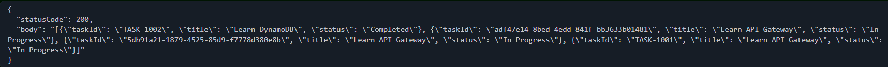
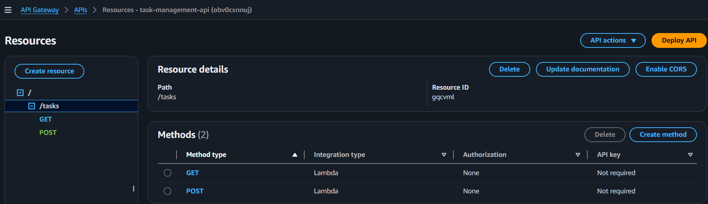
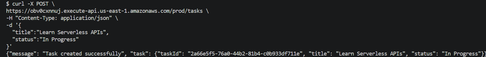
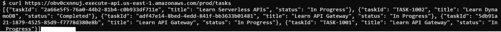
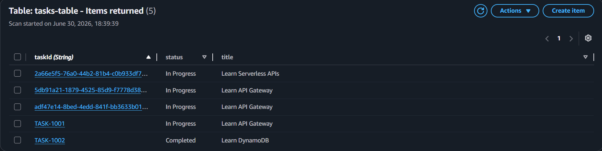

# Lab 06: API Gateway with Lambda and DynamoDB

## Objective

Built a fully serverless REST API using Amazon API Gateway, AWS Lambda, and Amazon DynamoDB. The API allows users to create tasks and retrieve existing tasks without managing any servers.

---

## Architecture Diagram



---

## AWS Services Used

* Amazon API Gateway
* AWS Lambda
* Amazon DynamoDB
* AWS IAM
* Amazon CloudWatch Logs

---

## Concepts Covered

* REST API Development
* Serverless Architecture
* API Gateway Integration
* Lambda Proxy Integration
* DynamoDB CRUD Operations
* JSON Request Processing
* IAM Roles and Permissions
* CloudWatch Monitoring

---

## Repository Structure

```text
level-200/
└── lab-06-api-gateway-with-lambda-and-dynamodb/
    ├── README.md
    ├── assets/
    │   ├── api-gateway-with-lambda-and-dynamodb-architecture.png
    │   └── screenshots/
    │       ├── dynamodb-table-created.png
    │       ├── dynamodb-sample-items.png
    │       ├── task-api-lambda-role-created.png
    │       ├── task-api-lambda-created.png
    │       ├── lambda-post-task-test-success.png
    │       ├── lambda-get-tasks-test-success.png
    │       ├── api-gateway-resources-created.png
    │       ├── api-post-task-success.png
    │       ├── api-get-tasks-success.png
    │       └── dynamodb-task-created-via-api.png
    │
    ├── lambda/
    │   ├── lambda_function.py
    │   └── lambda.zip
    │
    ├── sample-events/
    │   ├── post-event.json
    │   └── get-event.json
    │
    └── scripts/
        ├── verify-api.sh
        └── cleanup.sh
```

---

## Architecture Overview

Implemented the following serverless architecture:

```text
Client
   │ HTTPS Request
   ▼
Amazon API Gateway
   │
   ▼
AWS Lambda
   │
   ▼
Amazon DynamoDB
```

The architecture exposes REST endpoints through API Gateway, processes business logic in Lambda, and stores application data in DynamoDB.

---

## Project Implementation Steps

### Step 1: Create DynamoDB Table

Created a DynamoDB table:

| Setting       | Value       |
| ------------- | ----------- |
| Table Name    | tasks-table |
| Partition Key | taskId      |
| Data Type     | String      |
| Billing Mode  | On-Demand   |

Purpose:

* Store task information.
* Provide scalable NoSQL storage.
* Support serverless backend operations.

---

### Step 2: Insert Sample Data

Inserted sample items into the table.

Example item:

```json
{
  "taskId": "TASK-1001",
  "title": "Learn API Gateway",
  "status": "In Progress"
}
```

Additional sample item:

```json
{
  "taskId": "TASK-1002",
  "title": "Learn DynamoDB",
  "status": "Completed"
}
```

---

### Step 3: Create Lambda Execution Role

Created IAM Role:

```text
TaskApiLambdaRole
```

Attached policies:

* AWSLambdaBasicExecutionRole
* AmazonDynamoDBFullAccess

Purpose:

| Policy                      | Usage                               |
| --------------------------- | ----------------------------------- |
| AWSLambdaBasicExecutionRole | Send logs to CloudWatch             |
| AmazonDynamoDBFullAccess    | Perform CRUD operations on DynamoDB |

---

### Step 4: Create Lambda Function

Created Lambda function:

```text
task-api-function
```

Configuration:

| Setting        | Value             |
| -------------- | ----------------- |
| Runtime        | Python 3.13       |
| Architecture   | x86_64            |
| Execution Role | TaskApiLambdaRole |

---

## Lambda Source Code

### lambda/lambda_function.py

```python
import json
import boto3
import uuid

dynamodb = boto3.resource('dynamodb')
table = dynamodb.Table('tasks-table')


def lambda_handler(event, context):

    http_method = event['httpMethod']

    # Create Task
    if http_method == 'POST':

        body = json.loads(event['body'])

        task_id = str(uuid.uuid4())

        item = {
            'taskId': task_id,
            'title': body['title'],
            'status': body['status']
        }

        table.put_item(Item=item)

        return {
            'statusCode': 201,
            'body': json.dumps({
                'message': 'Task created successfully',
                'task': item
            })
        }

    # Get All Tasks
    elif http_method == 'GET':

        response = table.scan()

        return {
            'statusCode': 200,
            'body': json.dumps(response['Items'])
        }

    return {
        'statusCode': 400,
        'body': json.dumps('Unsupported method')
    }
```

---

### Step 5: Package and Deploy Lambda

Packaged Lambda function:

```bash
zip lambda.zip lambda_function.py
```

Uploaded the deployment package through the AWS Lambda console.

---

### Step 6: Create API Gateway REST API

Created REST API:

| Setting       | Value               |
| ------------- | ------------------- |
| API Name      | task-management-api |
| Endpoint Type | Regional            |

Created resource:

```text
/tasks
```

Created methods:

```text
GET /tasks
POST /tasks
```

Enabled:

```text
Lambda Proxy Integration
```

Integrated both methods with:

```text
task-api-function
```

---

### Step 7: Deploy API

Deployed API to stage:

```text
prod
```

Invoke URL format:

```text
https://<api-id>.execute-api.us-east-1.amazonaws.com/prod
```

Available endpoints:

```text
GET  /prod/tasks
POST /prod/tasks
```

---

## API Testing

### Create Task

```bash
curl -X POST \
https://<API_URL>/tasks \
-H "Content-Type: application/json" \
-d '{
  "title":"Learn Serverless APIs",
  "status":"In Progress"
}'
```

Expected response:

```json
{
  "message": "Task created successfully"
}
```

---

### Retrieve Tasks

```bash
curl https://<API_URL>/tasks
```

Expected response:

```json
[
  {
    "taskId": "...",
    "title": "...",
    "status": "..."
  }
]
```

---

## Local Test Events

### sample-events/post-event.json

```json
{
  "httpMethod": "POST",
  "body": "{\"title\":\"Learn API Gateway\",\"status\":\"In Progress\"}"
}
```

### sample-events/get-event.json

```json
{
  "httpMethod": "GET"
}
```

---

## Validation

Verified:

```text
✓ DynamoDB Table Creation
✓ Sample Data Insertion
✓ IAM Role Creation
✓ Lambda Deployment
✓ Lambda Test Events
✓ API Gateway Configuration
✓ API Deployment
✓ POST Request Success
✓ GET Request Success
✓ DynamoDB Integration
✓ End-to-End Serverless Workflow
```

---

## CloudWatch Monitoring

Verified Lambda execution logs from:

```text
/aws/lambda/task-api-function
```

Used CloudWatch Logs to troubleshoot API requests and Lambda execution.

---

## Screenshots

### DynamoDB Table Created



### Sample Items Added




### Lambda Function Created



### Lambda POST Test Success



### Lambda GET Test Success



### API Gateway Resources



### API POST Request Success



### API GET Request Success



### DynamoDB Task Created via API



---

## Key Learnings

* API Gateway acts as the front door for serverless applications.
* Lambda Proxy Integration forwards the complete HTTP request to Lambda.
* DynamoDB provides scalable NoSQL storage for serverless applications.
* API Gateway and Lambda together enable fully serverless backend architectures.
* CloudWatch Logs are essential for monitoring and debugging APIs.

---

## Production Considerations

Production environments should additionally implement:

* Least privilege IAM policies
* API Authentication and Authorization
* Amazon Cognito or JWT authentication
* API Throttling and Rate Limiting
* CloudWatch Alarms
* DynamoDB Point-in-Time Recovery
* AWS WAF protection
* Infrastructure as Code using Terraform

---

##  Notes

### How does API Gateway invoke Lambda?

API Gateway receives HTTP requests and forwards them to Lambda using Lambda Proxy Integration.

### What is Lambda Proxy Integration?

Lambda Proxy Integration passes the complete HTTP request to Lambda, allowing Lambda to handle routing and request processing.

### Why use DynamoDB?

DynamoDB provides fully managed, highly scalable, serverless NoSQL storage.

### What is a partition key?

A partition key uniquely identifies items and determines how data is distributed across partitions.

### Why build serverless APIs?

Serverless APIs eliminate server management, automatically scale, and reduce operational overhead.

---

## Status

```text
✅ Lab Completed

✅ Serverless REST API Implemented

✅ API Gateway Successfully Integrated with Lambda

✅ DynamoDB Backend Successfully Integrated

✅ Production Serverless Patterns Applied
```
